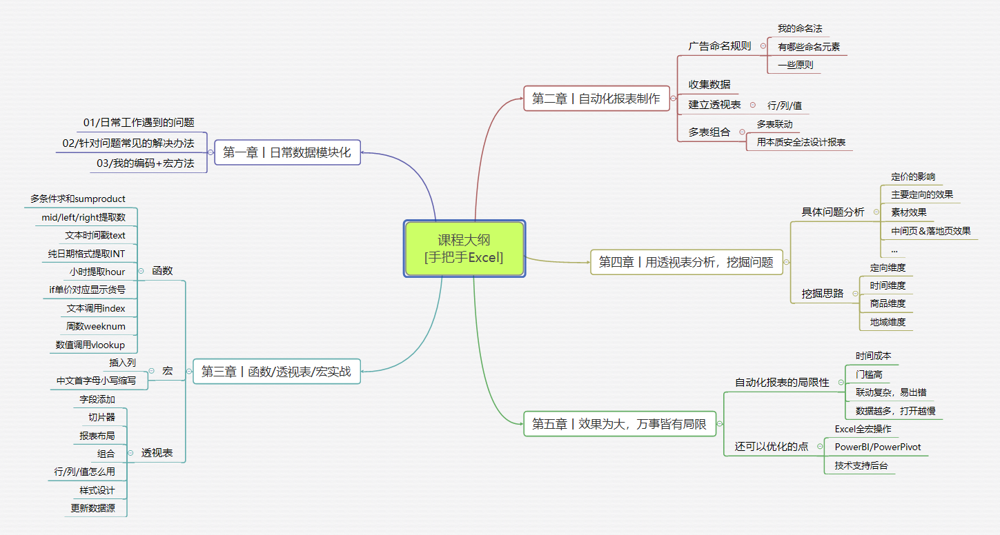
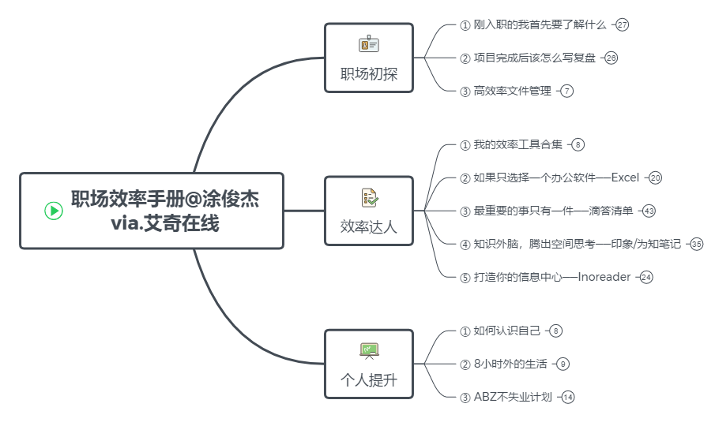
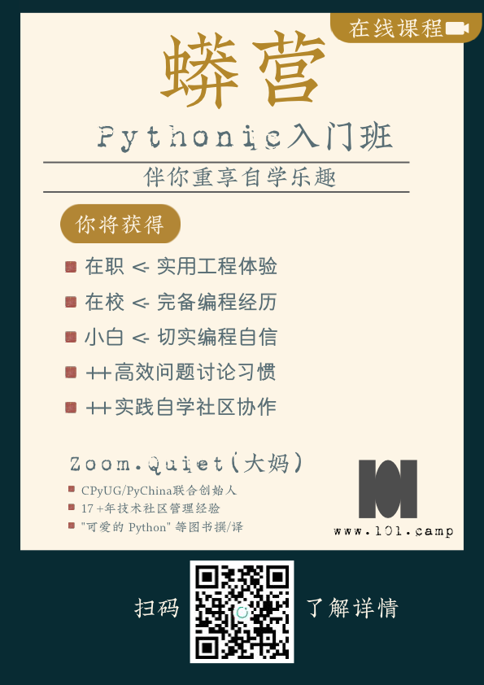

# 特别推荐

学习之路需要良师益友为伴，把我的朋友们推荐给大家！

### 职场效率 - 涂俊杰

除了网易云课堂的时间记录课，我的其他付费课都是干货无废话，剪掉了95%语气词。

* [《Excel自动化报表实操课》](https://www.aikewang.com/course/14)

* [《
  互联网职场效率手册》](https://www.aikewang.com/course/128)

> 福利：直接微信我报名有**5折优惠**！

### Anki - Leo

Leo是国内使用Anki的大神，如果你想学习Anki，提高学习效率，找他准没错！

公众号：学习骇客

详细的课程介绍请看：http://t.cn/E9jAU3n

[购买地址](https://item.taobao.com/item.htm?spm=a1z10.1-c.w4004-21524861135.5.49bd3d9ckGqvDC&id=595307408604)：淘宝店搜索店铺“学习骇客”

> 福利：购买时说“涂俊杰”推荐，有9折优惠！

### Python - Zoom.Quiet

Zoom.Quiet是真·Python大牛！

用Python17年，培训经验13年，这可不是新兴的讲师，而是元老级的实践者。

推荐他亲自带的Python入门训练营，可以扫码加他的免费星球参观！

Python训练营官网：https://py.101.camp/\#101camp

课程介绍：http://t.cn/AiRoJRnR

> 福利：扫码报名时在“引荐”处填写“涂俊杰”，可减免学费99元！

### 极速写作 - 剑飞

我在本书开篇就说剑飞是我的[启蒙导师](https://shijian.tujunjie.com/ch01/ch01.01)，他现在专注付费指导语音写作，指导学员创作字数破4亿！

报名链接：http://t.cn/AiR74CNq

★ 时间记录2020年度版报名链接：https://mp.weixin.qq.com/s/2xdoRq2UV4GG03\_U\_SQWtA

