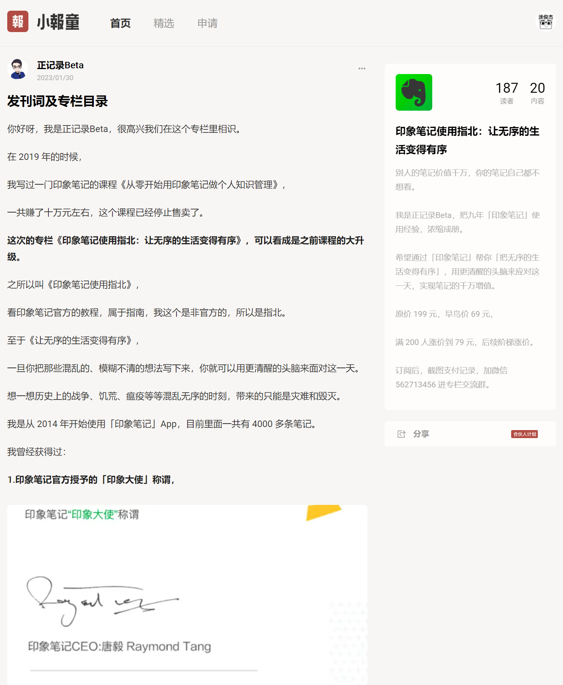

# 🌟 特别推荐

学习之路需要良师益友为伴，把我的朋友们推荐给大家！

### 职场效率 - 涂俊杰

除了网易云课堂的时间记录课，我还有一门职场效率课。

* [《互联网职场效率手册》](https://www.aikewang.com/course/128)

> 福利：直接微信我报名有**优惠**！

### Anki - Leo

Leo是国内使用Anki的大神，如果你想学习Anki，提高学习效率，找他准没错！

公众号：[学习骇客](https://mp.weixin.qq.com/s/OIw7p538gBoMsSM384G\_bw)

> 福利：购买时说“涂俊杰”推荐，有9折优惠！

### 极速写作 - 剑飞

我在本书开篇就说剑飞是我的[启蒙](ch01/ch01.01.md)导师之一，他现在专注付费指导语音写作，指导学员创作字数破4亿！

### 印象笔记使用指北 - 正记录

正老师曾是 aTimeLogger 社群的分享嘉宾，也是印象笔记大使，如果大家有笔记类需求，可以[联系他](https://xiaobot.net/p/EvernoteGuide?refer=e26e6522-2485-4e7e-9f19-256aae002ccd)。

<figure><figcaption>
小报童专栏
</figcaption></figure>
