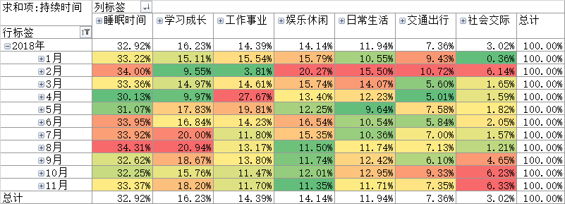
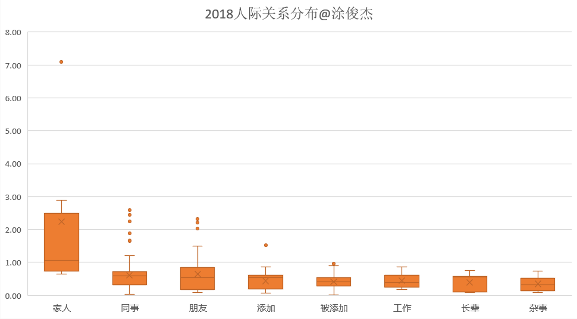
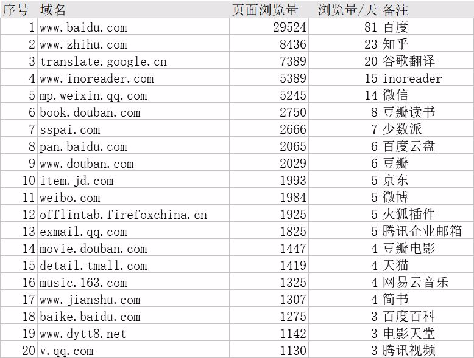
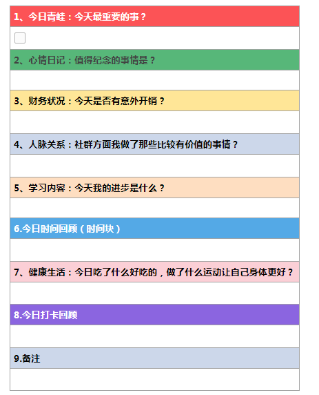

# 后记

我在书里一直强调“合适”，不知道会不会给人一种“时间记录还没有好到让我无脑推”的感觉。

如果你能看到这里，我要告诉你，“记录术”我就是无脑推，只要你学，我保证你有所得！

记录什么？绝不仅仅是时间，还可以记录日记，[随笔](http://mp.weixin.qq.com/s?__biz=MzI3MzU5MDA1OQ==&mid=2247484663&idx=1&sn=04f0a87ec799f88f8cb1020b8b529e65&chksm=eb21b6b3dc563fa51126c73fbd133af2541bbd09fc948bb8ca8280574f2383f8a489ac821292&scene=21#wechat_redirect)，[财务](http://mp.weixin.qq.com/s?__biz=MzI3MzU5MDA1OQ==&mid=2247484732&idx=1&sn=83d0392be7f72915b1c8590344340998&chksm=eb21b778dc563e6e7015553788a3273e6084ee6cfcd497da9403cd1cb2068ff99af96ea9087d&scene=21#wechat_redirect)，[想法](http://mp.weixin.qq.com/s?__biz=MzI3MzU5MDA1OQ==&mid=2247484558&idx=1&sn=5f6dbb873b63c920f255c266e48f3956&chksm=eb21b6cadc563fdc776f7ba29ab568cdcf9c1498139520d62e38db9b1e246ec25a482f976dc0&scene=21#wechat_redirect)，[人脉](http://mp.weixin.qq.com/s?__biz=MzI3MzU5MDA1OQ==&mid=2247484754&idx=1&sn=0ea6e543dadfd3f4d2dd0afcfb0a57fe&chksm=eb21b716dc563e0097c6acbf94e3bed6c128ea6315f5f52105509e4e515c078495e1af82d12e&scene=21#wechat_redirect)，[时间记录](http://mp.weixin.qq.com/s?__biz=MzI3MzU5MDA1OQ==&mid=2247484615&idx=1&sn=ae0f6350d150da32913199859969a79b&chksm=eb21b683dc563f95794eee235d5e3e4cd671c118a81bb244bec4629805933c38c93d458ce250&scene=21#wechat_redirect)，[网页浏览量](http://mp.weixin.qq.com/s?__biz=MzI3MzU5MDA1OQ==&mid=2247484675&idx=1&sn=5da93eba9aefd0c6a41f9267d1a61706&chksm=eb21b747dc563e515682df6ad9e8cfa487c5bc98324681abb54145e55273e09e1bdbdd87be36&scene=21#wechat_redirect)，工作日志，[物品清单](http://mp.weixin.qq.com/s?__biz=MzI3MzU5MDA1OQ==&mid=2247484522&idx=1&sn=bafef93ee00e8e9c22665d6e6a392d54&chksm=eb21b62edc563f380af183357ebcc4d9bd3ed8fc85e69349445ebdfb4f97cc152c614a0db9e3&scene=21#wechat_redirect)等等。

我相信不少人都尝试过这些记录，但能坚持下来的人并不多，放弃的原因大多是“**没用**”。

但很多厉害的大咖并不这样认为，比如他们：

**@成甲《好好学习》**

> * 美国国立卫生研究院曾经做过一个研究，他们帮助1600位有肥胖问题的人减肥。两组人减肥的方法一样，只是要求其中一组必须记录自己的饮食，**只是记录**下来就行，不用再做任何事情。
> * 在我们公司，培训员工记录反思日志，还有一个建议，那就是要记录自己的**情绪和思考**的过程，而不仅仅记录事情的结果。
> * 记录是**主动思考**的过程，是挖掘看得见的事情背后看不见的关系。

**@丹尼尔·平克《时机管理》**

> * 花一周时间记录你在下午时的**情绪和能量**水平值，包含你的大脑灵敏程度和体能充沛程度，找出自己下午的低谷时间，对许多人来说大约是早上醒来的七小时后，在那段时间你会发现当所有事情都开始变糟，那就是你理想的午睡时间。

**@孙圈圈《请停止无效努力》**

> * 发现自己的**天赋**，花一周的时间，用表格记录你感到强大和沮丧的瞬间，并根据SIGN原则，筛选出可能跟天赋相关的瞬间。

**@发愤的草莓《现在就干》**

> * 记录本身就有意义，当你在记录时也在**监督**自己。
> * 记录的数据不仅将来可以向子孙吹牛，最重要的是用这种方式向自己**诚实**的汇报时间的用法，对逝去的时间表达敬畏之情。

**@李笑来《把时间当作朋友》**

> * 最要命的、也更可能因为你没有记录而带来的结果是：你根本就没体会到自己有任何理由自责——因为你**不知道**你失去的是什么。
> * 有条件的话，最好固定一段时间来把那些目前暂时无法理解的、支持的、反对的、无所谓的论点和**观点**记录下来。对无法理解的，写下自己当时的疑惑何在；对支持的，记录几个理由或者实例；对反对的，同样记录几个理由或者实例；甚至对那些无所谓的，也记录其原因。一个有着这样良好记录习惯的人会获得他人无法拥有的处理信息和知识的能力——“反刍”。

**@艾力《你一年的8760小时》**

> * 每周记录完成之后，我都会进行一个**反思**，把每周做的有意义的、傻的事情记下来。比如我会记录每周看过什么书、什么电影以及印象最深的5件事——这5件事是这周相对来说最有意义的，记下来会相当有收获。你每周做的最傻的事是什么，这点更重要。我以前就做了很多傻事，包括我的手机掉到马桶里，被骗了钱，还丢了护照。我都记了下来，只要我以后不再犯相同的**错误**就行了。但是你会发现，大部分人，这一生都在犯相同的错误。

**@吴军《见识》**

> * 做任何职业，比如工程师、会计师、律师，都会遇到一些难题，解决了这些难题，我们就进步了。遗憾的是，大部分人过分相信自己的记忆力，以为自己能记住，但实际上很快就忘了，等到第二次、第三次遇到同一个问题时，还是束手无策，或者花很多时间去解决。因此，这是凡事做记录的好处之一。做记录的另一个好处是，在记录的过程中又**思考**了一遍，进步得会更快。相比之下，欧美人比较喜欢记录，他们发明一个东西是可以给当时的时代一个定义，比如美国工业崛起的时代等，当时是如何做实验的，今天依然能找到记录，这样经验也容易**积累和传承**。相反，在中国，失传是个非常常见的词，以至常常在低水平上重复发明。

**@剑飞《极速写作》**

> * 只要这件事情是真正发生的，有记录的才能被**回顾**。
> * 所有被记录下来的内容都有可以被**改进**的空间。

**@彼得·德鲁克《卓有成效的管理者》**

> * 如何**卓有成效**？1）记录并分析时间的使用情况；2）把眼光集中在贡献上；3）充分发挥人的长处；4）要事优先；5）有效决策。
> * 许多有效的管理者都经常保持这样的一份时间记录，每月定期拿出来检讨。至少，有效的管理者往往以连续三四个星期为一个时段，每天记录，一年内记录两三个时段。有了时间耗用的记录样本，他们便能自行**检讨**了。半年之后，他们都会发现自己的时间耗用得很乱，浪费在种种无谓的小事上。经过练习，他们在时间的利用上必有进步。但是管理时间必须持之以恒，才能避免再回到浪费的状态上去。

**@瑞·达利欧《原则》**

> * 我意识到，在人际关系中，人们应当把各自的相处原则说得极为清楚，这至关重要。以此为起点，我们开始**书面**记录我们的原则，这种做法持续了几十年，最终形成了“工作原则”。

**@ 菲尔·奈特《鞋狗》**

> * 我仔细记录着公司的**成功**秘诀和**失败**原因。

**@博多·舍费尔《财务自由之路》**

> * 随着时间的推移，你还需要一本**思想日记**本，记录你所有的创意，一本关系日记本记录所有使你快乐的关系，一本知识记录本，记录你从自己犯过的错误中学到的所有东西，使你不会再重蹈覆辙。

为什么这么多大咖都不约而同的推荐“记录”，但你却觉得没用？

**方法没错，是你错了。**

比如，[写日记](http://mp.weixin.qq.com/s?__biz=MzI3MzU5MDA1OQ==&mid=2247484707&idx=1&sn=a50c52b3da316a7174adc96b0941d15f&chksm=eb21b767dc563e711ea70c56fd310a1da3b781749062cd32b44f1cf70f060bd02d9869abd98e&scene=21#wechat_redirect)时你是写流水账且从来不回看，还是像这样：

1. 第一步：写下今天发生的事
2. 第二步：为发生的事分类，财务/人际/工作等
3. 第三步：标记能引发自己强烈情绪波动的事件
4. 第四步：设置周期，定期回顾

如果你能一直坚持记录，那么你能收获的能力是：

* 你能在50年后准确知道50年前的你身上发生了什么事
* 你能分析引发自己“愤怒”的事件，远离可能引发你愤怒的人和事
* 你能针对性分析你的“工作”经历，找到你的核心竞争力

总结来说，当你开始记录，并且能坚持下去，那么你会慢慢收获：

* **对自己身体/情绪/天赋/兴趣的精准认知**
* **提高自己的深度思考能力**
* **开启上帝视角，有效的监督自己**
* **少犯同样的错误**
* **让你的经验得以传承**
* **积累大量可以被分析回顾并流传的素材**

及时记录**并非沉迷过去**，恰恰相反的是，记录面向未来存在，它让我能通过历史数据修正自己的下一步行动，将来有机会过得更好。

我的[自传](http://mp.weixin.qq.com/s?__biz=MzI3MzU5MDA1OQ==&mid=2247484633&idx=1&sn=4aada58de098175ab7a33f6f99d49401&chksm=eb21b69ddc563f8b4f61322a6cb756277c3c8fb780434189f6273798a9bdb42635f175b1dd1d&scene=21#wechat_redirect)，[年报](http://mp.weixin.qq.com/s?__biz=MzI3MzU5MDA1OQ==&mid=2247484438&idx=1&sn=70dc021c1d0ab16a86625f9bc9677c10&chksm=eb21b652dc563f44e43d0a3e4a2a360747f39dbca58e717c3a5abaff20fe53c561172c774ca0&scene=21#wechat_redirect)，[计划和目标](http://mp.weixin.qq.com/s?__biz=MzI3MzU5MDA1OQ==&mid=2247484761&idx=1&sn=1a82efaf1c323e75b13b1e5745fc28c1&chksm=eb21b71ddc563e0b38b315878995cd6f26b5265c50e66be2961b7c17382e8b284dc5add5604c&scene=21#wechat_redirect)，大部分都是我从我记录的历史数据中诞生。

相信我，当你开始“正确地记录”，你会发现你得到的好处远不止这些！

如果你愿意尝试开始，那我推荐你可以从写日记开始，不必严格按照前文日记格式，开始写就好，坚持一周试试。

觉得干写没头绪的话，也可以试试用这套模板：

最后，让我们想象一个场景。

> “当你70岁儿孙绕膝，子孙们问你，**您有什么经验可以分享给我的吗？**
>
> 你会怎样回答？”

别想了，Just Do It.

