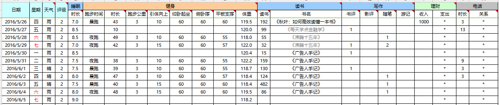
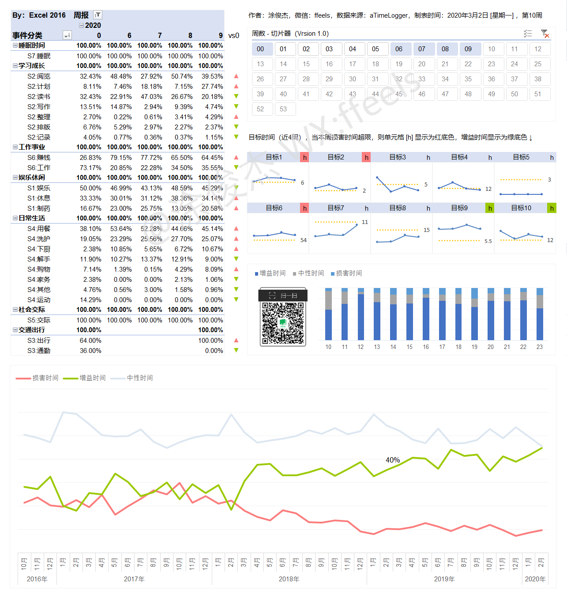
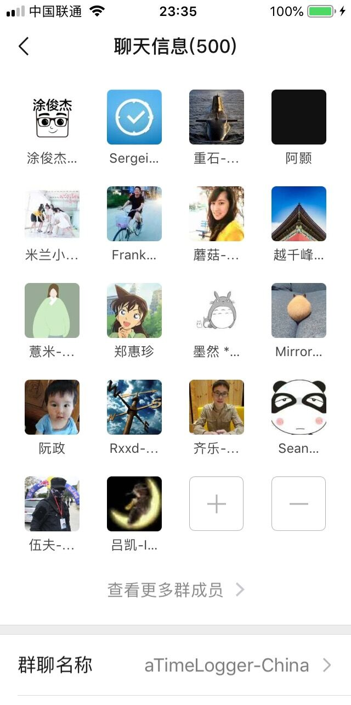
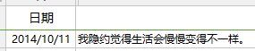

# 前言

> 当你老了，回顾一生，就会发觉：什么时候出国读书、什么时候决定做第一份职业、何时选定了对象而恋爱、什么时候结婚，其实都是命运的巨变。只是当时站在三岔路口，眼见风云千樯，你作出抉择的那一日，在日记上，相当的沉闷和平凡，当时还以为是生命中普通的一天。
>
> ——《杀鹌鹑的少女》

2015年年末，我在知乎上看见《怎么总结你的2015年？》这个问题，想说些什么，却又觉得无从谈起。

那种无力感瞬间击中了我，我觉得自己过得浑浑噩噩，我不想再这样下去。

2016年年初，我先后读完了@邹鑫老师的《小强升职记》和@李笑来老师的《把时间当作朋友》，我决定要留下点儿什么。

我当时打着赤膊，躺在出租屋的房间地下，地上铺着凉席，正歪着头刷手机的我突然想到，“诶，能不能把每天的生活用数字记录下来，量化自己呢？”

说干就干，我用Excel创建了第一张生活记录表。

现在回想起来，我一直以为那只是我生命里普通的一天，普通的我为自己种下了一颗普通的种子，不普通的是，今天，这颗种子结果了。

这几年里，我一直在努力搭建自己的量化体系，思考如何把生活数据化。

我记录日记，想法，情绪，随笔，人脉，工作日志，财务收支，时间流向，网页浏览量，物品清单等等。

我每年坚持为自己写一份年报：

> [个人大数据：涂俊杰2016年的8760小时](https://www.jianshu.com/p/48f17baa5b68)
>
> [个人大数据：涂俊杰2017年的8760小时](https://mp.weixin.qq.com/s?__biz=MzI3MzU5MDA1OQ==&mid=2247484438&idx=1&sn=70dc021c1d0ab16a86625f9bc9677c10&chksm=eb21b652dc563f44e43d0a3e4a2a360747f39dbca58e717c3a5abaff20fe53c561172c774ca0#rd)
>
> [个人大数据：涂俊杰2018年的8760小时](https://mp.weixin.qq.com/s/QZEl3droA1o3KP1RLooBqA)
>
> [个人大数据：涂俊杰2019年的8760小时](https://mp.weixin.qq.com/s?__biz=MzI3MzU5MDA1OQ==&mid=2247486123&idx=1&sn=1b7f16dd569747991fa2560aab452c4e&chksm=eb21b8efdc5631f9e1fc4b9266a18b5e6755ba0bdae86d221473d23bc2e6eac7161013c1b55c&token=1292930385&lang=zh_CN#rd)

在所有记录中，最多人赞叹的就是我践行的“柳比歇夫时间记录法”。

从2016年10月到现在，我已经用[TimeTrack](http://timetrack.io/)软件记录了超过20000小时。

回头看4年前的我，只不过是个没人脉没资源的南漂小毛孩儿。

那时候我什么都没有，除了一个问题，时常盘旋在我的脑海，久不散去。

> **“普通人就不能为世界留下点儿什么吗？”**

答案是否定的。我要记录，记录发生在我身上的一切，记录属于我的历史！

4年后的我，写出了第一本时间记录电子书。

我已经是TimeTrack软件中国区的群管理，每天都有500位时间记录爱好者在微信群交流心得，我已经能主动控制时间的流向，把娱乐时间从17%降到了6%，我拿到了“时间记录”领域Top1的标签。

你现在正在哪儿呢？我不知道你在哪里看到这段文字。

你可能刚挤上地铁，你可能刚打开外卖，你可能打着赤膊穿着拖鞋，你可能只是随便看看。

你可能和我一样是个普通人。

但你可以选择改变，就从记录开始，记录下你的行为、情绪、时间。

> 美国国立卫生研究院曾经做过一个研究，他们帮助1600位有肥胖问题的人减肥。两组人减肥的方法一样，只是要求其中一组必须记录自己的饮食，只是记录下来就行，不用再做任何事情。结果，令人惊讶的事情发生了：在实验到第六个月的时候，那些每天做饮食记录的人比其他人多减了一倍的体重。
>
> ——《好好学习》

当你开始记录你就打开了“**觉察**”的开关，**你会意识到自己在做什么**，哪些是好的，哪些是不好的。

只有打开了这个开关，你才有可能“改进”。

3天，5天，10天，可能变化不大，但是3年，5年，10年后，培养“长跑思维”，你会回头感谢现在的自己。

> 因为不记录，就没有发生。

你开始用实际行动证明“普通人也能为世界留下点儿什么。”

人人生而伟大，欢迎加入我们 🙂

_PS.需要进群的同学请加作者微信ffeels申请_

