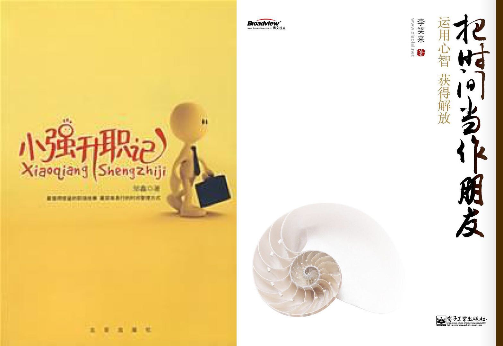

# 1.我的时间记录启蒙老师

**@邹鑫**，著有《小强升职记》《只管去做》，[http://www.gtdlife.com/](http://www.gtdlife.com/)

**@剑飞**，著有《极速写作》，[http://sikaoa.com/](http://sikaoa.com/)

**@李笑来**，著有《把时间当作朋友》《财富自由之路》等，[https://github.com/xiaolai](https://github.com/xiaolai)

2016年，我很幸运的通过@邹鑫老师的《小强升职记》接触到时间管理的概念，然后在读@李笑来老师的《把时间当作朋友》时意识到了可以通过时间记录的方式感知时间，和时间共同成长。

最后在网上搜索到@剑飞老师的简书专栏“[个人大数据](https://www.jianshu.com/c/a4ccc5c7fe53)”，他无私的公开自己的时间记录实操方法，教会我可以记录什么，用什么方式，也让我知道通过记录时间我可以分析什么，改进什么，去到哪里。

> [个人大数据 \| 关于时间记录体](https://www.jianshu.com/p/a473420d2b3b)
>
> [个人大数据\| 剑飞三年时间记录概](https://www.jianshu.com/p/4b0caceaa654)
>
> [剑飞 \| 让时间增值](https://www.jianshu.com/p/8ec5b32f9d72)

正是有这些前辈们无私的分享自己的经验，我才能做到更多。

希望这本书，就是对他们最好的感谢！

