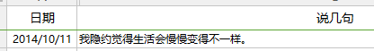

# 2.谁能坚持时间记录56年

> 亚历山大·亚历山德罗维奇·柳比歇夫（1890年4月5日——1972年8月31日），前苏联的昆虫学家、哲学家、数学家。毕业于圣彼得堡国立大学，一生发布了70余部学术著作，从分散分析、生物分类学到昆虫学等。他在26岁时独创了一种“时间统计法”，通过记录每个事件的花销时间，通过统计和分析，进行月小结和年终总结，以此来改进工作方法、计划未来事务，从而提高对时间的利用效率。期间他不断完善这一统计方法，并一直沿用了56年直到逝世。
>
> ——百度百科

柳比歇夫一生著作等身，但被世人熟知的，不是他的著作，而是他践行的“时间/事件记录法”。

这是一种由柳比歇夫26岁时独创的“时间统计法”。记录每个事件的时间花销，通过统计和分析，进行月小结和年终总结，以此来改进工作方法、计划未来事务，从而提高对时间的利用效率。

56年来，他不断完善这一统计方法，笔耕不辍，从不间断，一直到持续到他82岁去世，毅力惊人。

想更多了解柳比歇夫的生平，可以翻阅《[奇特的一生](https://book.douban.com/subject/1115353/)》这本书。

我读完这本书的第一反应就是佩服，牛🍺，第二反应是：

> 正常人应该都不会这样吧？

和现在大多数人对时间记录的态度一样，认可它的价值，但十动然拒。

不仅如此，我还在日记里写下“用不上”这句话。

没想到试用一段时间后“打脸了”，发现我还真不是个“正常人”。

从2016年10月开始坚持24小时全时段时间记录，一发不可收拾，到现在已经记录了超过20000小时。

细细想来，坚持时间记录，至少给我带来了三大好处。

