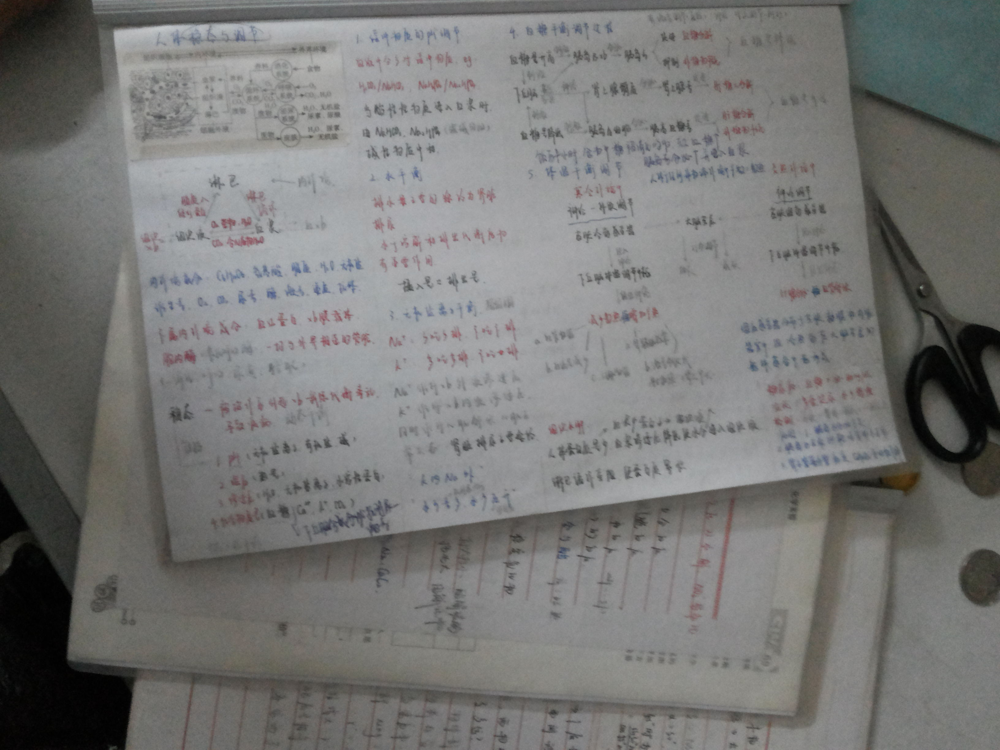

# 4.你希望通过时间记录获得什么

我曾经在朋友圈问大家，“你坚持时间记录是想因此而收获什么？”

大家的回答总结出来大概是这4条：

* 希望知道自己的时间花在哪了
* 想通过时间的分配认识自己
* 想通过时间记录让自己更高效更自律
* 想拥有数据化指标的参考

要我说，**时间记录是一种帮你重建生活秩序的方法。**

坚持时间记录你就能：

1. 拥有“长跑思维”，不仅活在当下，也着眼未来
2. 建立生活秩序，增强掌控感，减少焦虑和混乱
3. 通过真实的数据，发现自己的兴趣爱好
4. “看见”你的成长和改变
5. 磨练你的耐心，体验水滴石穿的力量

老话说“学如逆水行舟，不进则退”，生活也是一样，你不主动规划，就会被生活推着走。

柳比歇夫时间记录法非常适合：

* 有珍惜时间意识的同学，想知道自己的时间去哪儿了
* 想和时间成为朋友，更好更快达成目标的同学
* 想为世界留下点儿什么，甚至写一本自己的《史记》的同学
* 迷茫，不知道自己是谁又可以成为谁，希望更了解自己的同学
* 数据极客，痴迷量化，喜欢和数据打交道的同学

时间记录就是自己的一杆秤，不是放心里那种，而是拿到台面上量化，说一不二。

[很多大佬都在不同场合推荐过“记录”](https://mp.weixin.qq.com/s/GrgonlZPIa0yykui0XsC9A)，时间记录除了利用数据帮助我们自省之外，还可以积累和传承，沉淀下的数据可以让你拥有“时间旅行”的能力，迅速“回到”当天。

利用积攒的时间记录，我写成了自己人生的第[一本自传](https://mp.weixin.qq.com/s/BEOzB88Oj34h4b4M-0mxHA)。

也就是说，除了帮助你找到时间黑洞之外，时间记录还能辅助你改变行为，帮你留下人生经验，如果你希望认清自己，如果你觉得对生活失去了控制，不知道从哪儿重新开始，不妨试试“时间记录”。

相信我，你的人生**一定会**变得不一样！

就像我22岁那年，做普鲁斯特问卷的时候，里面有个问题。

> 你认为自己最伟大的成就是什么？

我当时的回答是“高考笔记”。

我的回答居然是“高考笔记”？

26岁，我做普鲁斯特问卷的时候，再次回答这个问题。

> 你认为自己最伟大的成就是什么？

我写的是，“时间记录2万小时，一日未断。”

带动更多人开始时间记录，甚至创建一座时间数据博物馆，想想就很激动呢！

那你呢，到今天为止，你觉得自己人生中最伟大的成就是什么？

