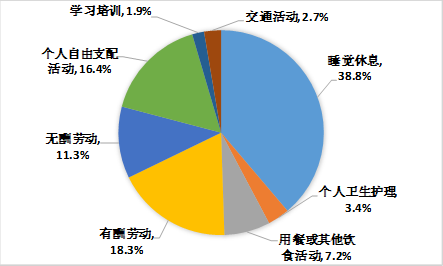

# 6.浪费时间的时候你会心痛吗

很奇怪，假如我们丢了86400块，应该会崩溃，但是浪费了1天的86400秒，却一点儿不觉得心痛。

**我们对时间的感知度远比钱要小，要迟钝。**

假设你从没做过任何时间记录，请你回答这三个问题：

1. 你每周/月花时间最多的3项活动是什么？
2. 你下班后在做什么，周末在做什么？
3. 你觉得自己有多少时间被“浪费”了？

你先想想这三个问题，然后我告诉你一些国人的平均数据。

1. 平均手机每天亮屏4-5小时
2. 平均每天看影视剧3-4小时
3. 个人自由支配活动平均用时4小时

中国国家统计局给出的《[2018年全国时间利用调查公报](http://www.stats.gov.cn/tjsj/zxfb/201901/t20190125_1646796.html)》解读写到。

> “看电视依然是居民的主要休闲方式，2018年为1小时40分钟，但比十年前减少了26分钟，占全天时间的比重为6.9%，下降了1.8个百分点；休闲娱乐时间为1小时5分钟，比2008年增加25分钟，占全天时间的比重为4.5%，提高了1.7个百分点。”

也就是说，大多说人都是睡觉8小时，工作8小时，剩下的8小时里，除开吃饭洗漱，再除去平均玩手机刷剧的时间，真正的可支配时间只剩下2小时，这2小时里，用来学习的时间也只有1.9%，平均每天27分钟。

**你每天有花27分钟在学习上吗？**

可能某天下午你真的为自己虚度光阴而羞愧过，但是也就羞愧那么几个小时吧，马上就又被微博热搜或是漂亮的抖音小姐姐吸引了注意力。

等到下次羞愧不知道要到什么时候，羞愧完之后又会有什么改变，恐怕是个“不要脸”的死循环。

还有一大部分人根本没意识到自己“正在浪费时间”。为什么推荐你做时间记录？因为记录就是个开关，让你重新感知时间的流逝，每天活在50多次（平均每天切换50次活动）强提醒当中，改变的几率飙升！

看了这份报告其实你也能发现，即便是不用时间记录，不学任何时间管理的方法论。

最简单、最实际的控制浪费时间的方法就是：

> **禁止刷剧和玩手机**

如果要容纳无处消耗的时间，就再多加两条：

1. 每天念一遍自己的目标
2. 找（1-3件）能赚钱的事做

想想看，当其他人没意识到自己在浪费时间的时候你意识到了，接着你把大多数人每天刷手机的4小时用来学习或者发展业余爱好，6年之后，你就能成为10000小时的专家，至少是某细分领域的Top10。

6年，其他人只会感叹“唉，时间怎么说没就没了。”而你，知道时间到底去哪儿了。

> 时间在哪，成就就在哪。

