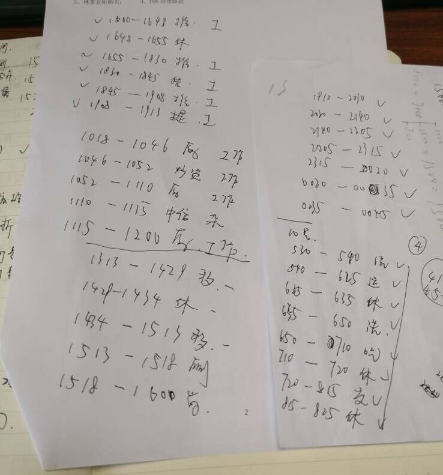

# 8.用纸笔快速开始

在“时间记录的成本”里，我提到如果全时段记录，每天需要在软件上花费20分钟。

有同学会觉得，“还要学习软件的操作呀，真麻烦”就放弃了。

之前就说过“时间记录只是一种达成目标的手段”，工具不重要，有纸笔就能马上开始。

不信？我们举个例子，定个目标：“你希望用时间记录达成什么目标？”

> “我希望知道我每天上班的10小时都在干什么？”

别觉得这个问题无聊，自己上班在干啥还能不知道吗？收发邮件，对接需求，开会，加班呗。

不一定。

来实践试试。

从明天开始，凡是你工作的时间就用纸笔在本子上记下做事的时间区间，比如：

> 09:00-09:15——整理文件
>
> 09:15-09:30——收发邮件
>
> 10:10-10:40——领导开会

至于上厕所，开小差，查资料，和同事闲聊，这些时间都不能计入，坚持记3天。

（没事，你的领导不会看见这张表的，要保证真实有效 😀）

不出意外的话，3天后，你的记录会和这张表类似。

> 第一天，工作时间3.4小时
>
> 第二天，工作时间5.2小时
>
> 第三天，工作时间4.5小时

统计结果是，平均每天工作4.4小时。

如果你真的自己每天上班10小时，结果记录后发现真实的工作时间只有4.4个小时，你会怎么想？

**你觉得自己真的是上班上了10小时，还是只是在办公室呆了10小时？**

时间都去哪儿了？那些没记录的空白区间，你用什么填补的？聊聊天，划划水，吃个泡面？

现在你明白了吧，时间记录的第一个作用就是“发现想象和现实的差距”。

根据我的经验和观察，大部分人在工作中的“时间效率”在65%到85%波动。也就是说，每天7小时的工作时间，真正用来工作的可能只有5个小时。而且工作效率会随着时间的延长显著降低，并不像你想象的那样，花的时间越多，拿到的成果就越多。

除了“想象和现实的差距”之外，我们还能从这张时间表里，看到2点不合理的地方：

1. 收发邮件的时间太碎片，影响工作效率
2. 做PPT的时间太久

想改变，接下来你至少可以做2件事：

1. 除了重要人物设置邮件提醒，其他邮件归在每天固定时间处理，且设定回复模板
2. 去补习PPT技能，学用插件，或者施展魅力让同事帮你做

这是时间记录的另一个作用，“找到耗时的时间块，针对性改进”。

因为我们在工作中常常会光顾着埋头苦干，遇到难题了，即便当时觉得好像哪里不对，但撑过去等事情完成了，又会嫌复盘麻烦不去想了，结果是再次遇到相同的场景时，又要花时间重复一遍，问题依然存在。

白纸黑字的记录可以让你看到问题，增强提醒，减少问题被忽视的可能性。

另外，你在做某事前用纸笔记录一次这个动作对大脑来说，就是一次“注意力切换”，这种切换仿佛就是在提醒自己“喂，你要开始做X了，专心点儿。”每次切换都让你“感觉好像更专注”了。

这种调用注意力的方法，就好比学习金字塔。

听不如写，学不如教，每次记录就是一次提醒，强化了学习的认知。

在这个例子里，我们只是纸笔记录就发现了：

1. 真实的时间消耗
2. 日常被忽略的2处遗留问题
3. 记录这个动作居然能提高注意力

从纸笔转软件，我用了5天左右，这5天手写记录，让我真正发现了记录的好处。所以我不会觉得TimeTrack上手麻烦，因为我知道它能明显提高我记录的效率，有了一份期待。

如果你准备开始时间记录，不妨就从纸笔开始。

觉得手写麻烦的话，也可以打印下图模板对照填写：

还有同学会觉得在工作时记录需要从键盘切换到纸笔不方便，其实也能用电脑记事本代替。

所以说，工具不是问题，纸笔就能快速上手。

等你从纸笔切换到TimeTrack软件后，你会觉得，哎妈呀，真方便。

