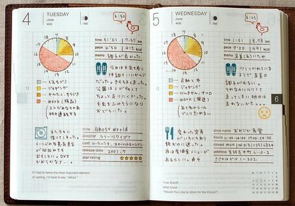
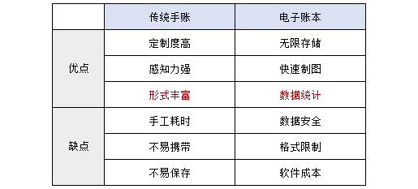
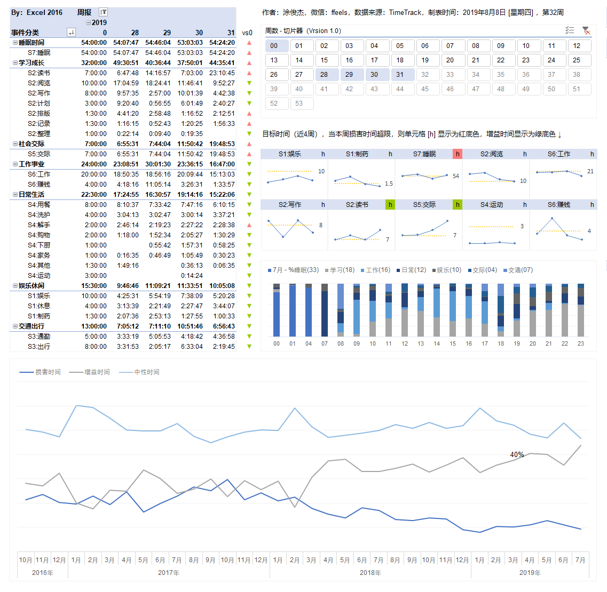

# 9.时间电子账和手账的区别

很如果建议新手从纸笔开始记录时间的话，很多同学可能会想到“手账”。

漂亮、可定制，随心所欲的手账吸粉无数，那用TimeTrack记录的电子账和手账有区别呢？

我用张表格对比说明：

各有各的特点，标红处就是最关键的问题，你更在意美观，还是数据的可分析性？

我看到漂亮的手账也会忍不住赞叹真美！但我十动然拒的原因除了绘图太耗时之外，不能跨时间维度统计分析是一大硬伤，试想你存了几本手账，想分析最近3年的时间消耗趋势，怎么下手呢？

而且，我觉得电子账有Excel可视化功底的话，做得不比手账差，也能美的很有科技感 😂

喜欢手账的朋友，可以自己动手试试，“工具不是最重要的”，大家选择合适自己的就好。

但如果你对时间电子账有兴趣，欢迎和我一起，创建属于你的时间账本。

