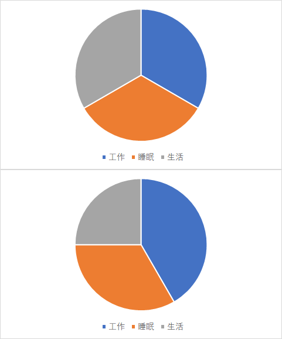
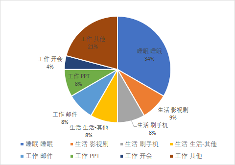
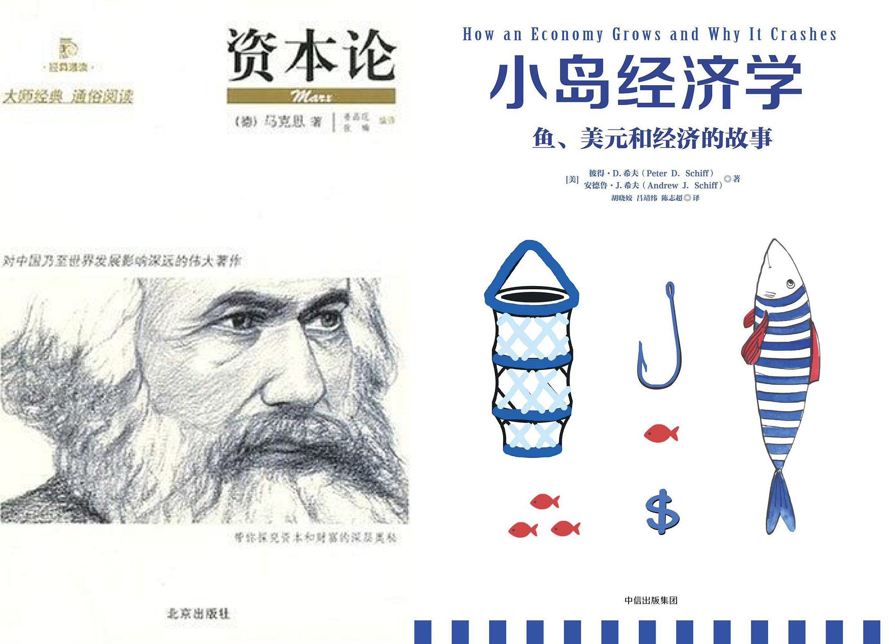

# 10.开始记录前最后劝你一次

在你兴致勃勃即将开始前，我可能还是要泼一盆冷水。

> 你想好了自己希望通过时间记录获得什么了吗？

有时候你想达成的目标并不一定非得通过时间记录才能完成，太注重形式，可能还会走了弯路。

比如我曾经给Q同学做时间记录的咨询。

我问他做时间记录的目的是什么，他说“想通过时间记录，找出自己的时间都去哪了。”

接着就问我TimeTrack软件怎么用，数据怎么处理等等“HOW”之类的问题，我说你别急着上工具。

我们试试用最简单的方法看能不能解决你的问题，我拿来纸笔。

让他画了2张饼图，第一张把时间平均分成“睡眠”、“工作”、“生活”3份，第二张让他回忆下最近一周的生活状态，在这三部分，哪部分时间消耗更多？

最后Q画出来，差不多是图2这样，他说，“我工作10小时，睡眠8小时，生活6小时。”

接着我又问，那你再想想，你工作的时候经常做什么事儿？按比例把工作的这10个小时填满，只写不超过3件最花时间的事，其余的事用“其他”代替。 

他想了想，又画了一张新的饼图，标注收发邮件2小时，做PPT2小时，开会1小时，其他5小时。

拆分完了工作之后，我让他和拆分工作时间块一样，继续拆“生活”时间。

然后Q画了一张这样的分配图。

我指着这几张图对Q说，“不用再做什么记录了，你的问题找到了。”

一开始Q有点懵逼，他说，“啊，就这么简单？”

我说是啊，就这么简单，通过梳理，你已经“看到”自己的时间流去哪儿了。

> 工作耗时大头：邮件、PPT、开会
>
> 生活耗时大头：影视剧、刷手机

就算你用TimeTrack软件计时，结果也差不多是这样，只不过更精确。

空气突然安静，我觉得我再不解释几句，Q就要我退钱了 😂

哈哈，开玩笑的，我要表达的意思是：

> **你没必要通过时间记录去找你平时最耗时间的部分，因为那部分是什么，你很清楚，只凭想象你就能找到。关键是，就算自己知道，你也不去做。所以问题不在“记录”而在“执行”。**

光知道自己的时间花在哪儿没用，还得针对性的提出你的期望和改进的想法，你希望你把时间花在哪儿，然后以你记录的时间为基准去改变，**主动控制流向**，这才是时间记录的意义所在。

用TimeTrack之类的计时软件，能帮你更精准的定位问题，但没办法替你改变。

这是我不希望大家一来就问“HOW”而是先问“WHY”的原因。

一旦深究方法论，很容易被繁琐吓到，而且还不一定适合你。就像有同学知道我是24小时全时段记录，也想24小时记录，但对新人来说，最重要的应该是：

1. 明确时间记录用来做什么
2. 养成记录的习惯
3. 从记录中获得“满足感”

想象一下，假如你是个刚对经济学产生兴趣的小学生，现在你想更多了解经济学，《资本论》和《小岛经济学》两本书，你会选哪个？假如被推荐了《资本论》，我担心你马上从爱好者被虐回路人。

当然，你如果天赋异禀，上来就“打10个”也不是不行。

最后，我来总结最简单的时间记录法5步骤：

1. 明确目标：为什么想记录时间
2. 画1张实际时间分配和预期时间分配对比图
3. 用纸笔（什么方便用什么）开始记录，适当忽略精度
4. 定期（天/周）复盘时间分布
5. 找不同，写出原因，执行

不太强求精度，记录的颗粒度从15分钟到半小时也都行。

比如市面上已有的常见方法：

* 34枚金币法

34枚金币法，源自@艾力《[你一年的8760小时](https://book.douban.com/subject/26695301/)》。

作者把一天24小时，排除睡觉的7小时，剩下的17小时分为34个半小时，每一小时代表着一枚金币，重点是每半小时记录一次时间，而非精确记录，其理论对应的软件有iOS的时间块。

* 推导性记录法

我的启蒙老师，《[小强升职记](https://book.douban.com/subject/25852981/)》的作者@邹鑫老师推崇的是“推导性纪录”，根据一段时间的大块记录，比如1-2周的范围，定位大块时间段，针对性改进即可，工具是其次。

* 主题记录法

主题记录法是“24小时全时段记录法”的精简版，只记录某个场景，比如只记录生活，或者只记工作。

这种方法适合新人上手，从记录“你认为最应该改变的时间块”开始，在这个最大的时间块里培养“记录→分析→行动”正循环，优先养成习惯。

方法还有很多，用哪个你随意，只要**确保是记录是真实的**。

回想起几年前，当我突然意识到时间一天天流逝，而我什么也抓不住的时候，我迫切想要一次改变，但我连从哪儿开始改起都不知道，所以我试着记录时间，先找出问题在哪。

这是改变我人生的一次“行动”，**从“我想要”变成了“我去做”**。

时至今日，我有能力把这几年实践的心得分享出来，把时间记录法推广给更多人，希望你也能逃出“浑浑噩噩的懒惰怪圈”，让你给自己装个“开关”，自己鞭策自己。

只管去做！别做“思想的巨人，行动的矮子。”

一点点梦想，一点点勇气，用新的方式去体察人生，你值得拥有更好的生活！

记住：

> 如果你只是等待，问题不会消失，发生的只会是你变老。

