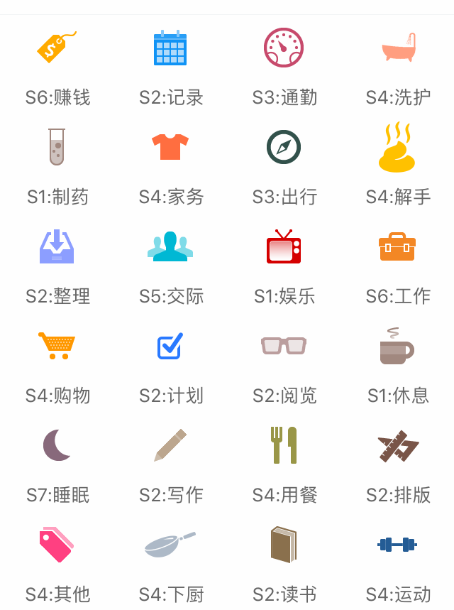

# 11.一篇文章讲清楚aTimeLogger

> 这篇文章是2019年7月给朋友@白宦成《[自我量化指南](https://www.ziwolianghua.com/time/timetrackio.html)》的约稿，如果要用一篇文章讲清楚aTimeLogger软件的基础操作，放这里作为“软件操作”篇指引正合适。

aTimeLogger和aTimeLogger Pro都是白俄罗斯开发者@Sergei Zaplitny开发的一款用于全时间段时间记录的App，目前提供iOS和Android版本应用，你可以分别在AppStore和华为应用商店搜索并下载。

> * aTimeLogger Pro官网：[http://timetrack.io/](http://timetrack.io/)
> * aTimeLogger官网：[http://www.atimelogger.com/](http://www.atimelogger.com/)
> * 开发者@Sergei Zaplitny反馈邮箱：support@aloggers.com
> * aTimeLogger/Pro安卓APK下载：[https://pan.baidu.com/s/1AzQaoE4iRHXga5elMXja3w?pwd=7vpx](https://pan.baidu.com/s/1AzQaoE4iRHXga5elMXja3w?pwd=7vpx)

### aTimeLogger  Pro和aTimeLogger的区别 

iOS aTimeLogger Pro分为免费，标准（38元）和高级（68元）三个版本，区别如下图示。

.jpg>)

如果是iOS aTimeLogger已付费用户，转移到aTimeLogger Pro账户，会自动升级为标准账户，再支付30元即可升级为高级账户。

现在所有版本均为**买断制**，一次付费，不再订阅。

而aTimeLogger在iOS需要付费30元下载使用，安卓免费使用，内置捐助渠道。

iOS下载付费直接可以使用全功能，安卓捐助后可以使用全功能，捐助后的变化如下图。

虽然两款软件都是@Sergei Zaplitny开发，同一账号数据互通，但不同系统间仍有差异，比如：

* iOS-aTimeLogger Pro没有备注自动补全功能
* 各个版本的视图功能样式不统一
* aTimeLogger没有位置、归档、番茄钟、倒计时等功能

软件上的“问题”，开发者都会慢慢修复补全，只是独立开发，时间很久。

而很多网友追问的aTimeLogger还会不会增加新功能？

aTimeLogger还在维护，但现状是新功能都只在aTimeLogger Pro更新。

各位根据自己的需求选择不同的软件版本。

**我个人建议是，新手iOS用户用aTimeLogger Pro，安卓用户用aTimeLogger。**

付费之前先用最少成本测试自己是否习惯这款软件的记录方式。

验证自己确实有记录时间的需求之后，再付费支持开发者也不迟。 ‌

另外，有些朋友会发现有盗版软件，请认清软件图标和开发者显示为“**BGCI**”下载。

.jpg>)

### 为什么使用aTimeLogger 

我2016年10月开始24小时全时段时间记录，到现在已经记录了超过20000小时，最早使用aTimeLogger（Android）记录，2019年转aTimeLogger Pro（iOS）。

开始时间记录的初衷是受到@邹鑫的《小强升职记》和@李笑来的《把时间当作朋友》启发，希望提高自己对“时间的知觉”，后来又参考了很多@剑飞老师的文章，形成了自己的时间记录体系。&#x20;

这三年时间，时间记录对我来说最重要的改变是“我能通过历史数据，主动控制时间的流向，达成目标”。

典型的变化是我的娱乐时间从17%降到现在的6%，交际时间从1.5%提高到7%，我每天脑子里都刻着时间目标，提醒自己进度到哪了。&#x20;

而就我的观察，时间记录特别适合这3类人：

1. 想知道自己的时间去哪了，通过记录完成自察
2. 记录自己的人生节点，想为世界留下点儿什么
3. 数据极客，个人量化爱好者

喜欢和数据打交道 如果你想摆脱浑浑噩噩“混时间”，欢迎你加入我们，和时间做朋友。

### aTimeLogger Pro的使用方法 

#### 默认设置 

打开aTimeLogger Pro，修改aTimeLogger Pro的默认设置如下：

1. 更多-设置-开始新活动时-暂停正在进行的活动并开始新活动
2. 打开“时间区间冲突提醒”
3. 日期格式2019-05-13，时间格式22:31
4. 导出数据格式：yyyy-MM-dd HH:mm:ss
5. 时间开始的第一天设置为“周一”
6. 打开“显示秒”
7. 最小活动持续时间-不设置

这是我推荐的的默认设置，你可以对应调整。&#x20;

#### 快速上手

调整好合适的默认设置后，掌握好这几个技巧就能快速上手了。

* 启动/停止计时

打开aTimeLogger Pro主界面，点击默认图标，软件就开始计时，点击暂停按钮则暂停计时，点击停止按钮则终止计时，且活动从主页面移动至“历史清单”归档，如果要再启动，需要在历史清单页面进入活动，修改状态为暂停或进行中。

软件允许同时为多项活动计时，但是不建议这么做，会导致一天超过24小时。

如果你开启活动后一直未暂停或停止，不管你清除后台还是关机，软件都会持续计时。

* 新建活动类别

默认的活动项分类可能并不合你的胃口，你可以新建自己想要的类别。在“类别”选项卡，点击右上角“+”，可以设置活动名称、图标和颜色。

设置完成后，右上角有排序图标，点击后可以手动调整图标排列顺序。

* 系统数据视图

软件提供饼图、日历视图、柱形图3种图形模式。

在“历史清单”选项卡，点击上方日期处，更改视图即可。

* 目标

在众多分类中，如果你需要特别关注某个指标，那么可以使用“目标”功能。

在“目标”选项卡，右上角“+”，新建目标，填写名称和时间等，“不低于”代表最少用时，多用在增益目标，“不超过”代表最多耗时，多用在损害目标，进度条会随着时间消耗有红黄绿三色变化。

* 搜索

如果你不习惯导出数据分析，也可以直接使用软件的内置搜索功能。

在“历史清单”选项卡下拉，选择数据日期范围，搜索关键字即可。

#### 分类技巧 

开始时间记录最麻烦，也最绕不过去的问题就是“如何为时间分类？” 我推荐的把所有时间项分成一，二级两个层级。 其中一级分类<7个，二级分类<30个，太少分不全，太多记不住，数量正好1屏为佳。

建议新手再保留一张活动定义表，如图示：

定期复盘当时不知道该如何归类的活动，然后把具体的行动添加到定义表中备忘。

#### 远程控制 

目前aTimeLogger Pro和aTimeLogger都只有移动端版本，桌面端还在开发中。&#x20;

对于工作时不方便频繁拿手机的人来说，替代方案是使用安卓模拟器。

1. 下载安装网易MuMu模拟器
2. 登录aTimeLogger账号，同步数据
3. 重新修改软件默认设置
4. 如果同步错误，重启软件即可

#### 数据导出 

导出数据的步骤：

1. 更多-报告-\[选择时间]-导出报告-CSV-分享
2. 使用WPS打开CSV文件（Excel乱码，用记事本打开另存编码为ANSI格式）
3. 储存到数据源表并进行分析

### 可以分析哪些数据 

有了数据之后就需要你发挥想象力，从数据中提取关键信息。 最常见的分析角度是：

* 频次
* 总和
* 比率

然后还需要你发挥一点儿想象力，向自己发问，比如你可以这样问。

#### 下班后我在干什么？ 

选中CSV中的明细数据，创建数据透视表，对活动项的持续时间求和，降序。&#x20;

筛选出工作日，选择19到凌晨时间段，如图示：

假设你的数据是这样，除了“睡眠”，排名第二的就是“娱乐”，你能说自己下班后还在继续学习，读书写作锻炼自我提高吗？

诚实记录的好处就是，让你虚假的借口无所遁形，直面恐惧，刺激改变。

#### 我应该换工作吗？ 

假设现在有两份工作，A工作月薪1万，换工作之后月薪1万3，涨幅30%，该跳槽吗？ 抛开环境等其他因素不谈，我们就从“时薪”角度算算这笔账。

在透视表中筛选“工作”，求得每月的持续时间之和，然后新建一列，填上当月薪资，用月薪/当月工作时长，得出“时薪”，选中数据，插入折线图。&#x20;

如图示：

我们发现从2018年1月换工作后，时薪从85元/h下降到62元/h，负增长22%。

表面上工资涨30%，实际时薪却负增长22%，从时薪角度考虑，这或许不是个好决定。

#### 你距离大师还有多远？ 

如果我们用“1万小时定律”来衡量技能的熟练度，你的熟练度达到1万小时了吗？

1万小时是什么概念呢？

**每天8小时，坚持3.5年，不间断的做一件事。**

对我来说，我平均每天花20分钟在aTimeLogger Pro（原名为TimeTrack）的记录上，加上每周20分钟分析，每月1小时分析，每年10小时年报总结。

除开刻意练习，单纯从时间角度看，我需要坚持55年，才算达成大师成就。

你呢？去看看你的时间记录，哪个活动项达成了“1万小时”大师成就？

### 总结 

如果你注重“精确”，希望全时段记录，而不是分块记录，那么我强烈推荐你使用aTimeLogger。

> 附群内部分享的aTimeLogger使用经验直播：[https://www.bilibili.com/video/BV1CY4y1W74A](https://www.bilibili.com/video/BV1CY4y1W74A)

在时间记录的过程中，一开始你会“意识到时间”，特别是当活动切换到“损害时间”时，点击这个动作就是第一次警示，告诉自己“喂，现在是损害时间，小心点儿花。”

这些留存下的时间记录除了利于你自省之外，还可以积累和传承，随着时间的增加，你会拥有“时间旅行”的能力，迅速“回到”某一天，寻找人生的关键线索。

**“时间一旦逝去，就再也找不回来。”**

珍惜时间，这是普通人最应该抓住的翻盘机会。
