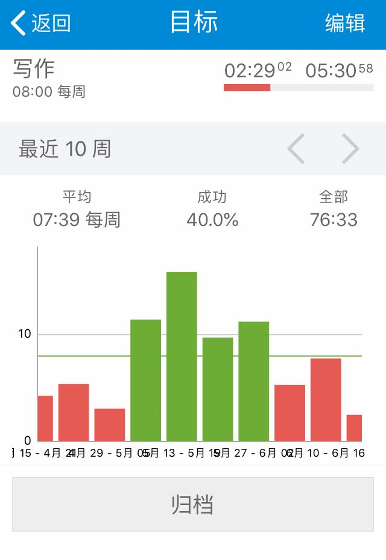

# 12.TimeTrack，用起来再说

如果初次上手TimeTrack，先来修改默认设置：

1. 更多-设置-开始新活动时-暂停正在进行的活动并开始新活动
2. 打开“时间区间冲突提醒”
3. 日期格式2019-05-13，时间格式22:31
4. 导出数据格式：yyyy-MM-dd HH:mm:ss
5. 时间开始的第一天设置为“周一”
6. 打开“显示秒”
7. 最小活动持续时间-不设置

> 要注意：iOS账号如果退出登录后，所有设置清除，再次登录需要重新设置。

然后在目标页新建一个名叫“我还在玩手机”的目标，设置活动包含“娱乐”，达成类型选择“不超过设置时间”，时间设置为每天2小时。

接着退回主页面，规则是，限制你只使用“娱乐”，“工作”和“其他”三个活动，工作上的事用“工作”记录，玩手机、看电影、打游戏用“娱乐”记录，其他睡觉走路洗漱时间，不属于“工作”和“娱乐”的都用“其他”记录，然后把你做了什么事写进备注栏。

我之前让新手Q同学执行这些操作，他试用2-3天之后，跟我反馈说：

> “诶，涂哥，你这个方法挺有用啊，我玩手机的时间真的少了好多，这3天时间“娱乐”就只超标了1次。我每次开启“娱乐”时间的时候，看到这个“次要计时器”上的倒计时，就不敢乱用了，感觉老是在提醒我“娱乐时间快用完了”，闲来无事经常想刷刷手机，算了，还是忍住了。”

能帮Q同学完成目标，我也挺高兴，又问问他在使用过程中还有什么感受。

他想想了，总结了这3条：

1. 可以直观看见目标，随时提醒我别超时
2. 每次都要点击才能记录，有点儿麻烦
3. 忙起来还是会忘了记录

第一条说明Q同学初次上手就掌握了TimeTrack最精髓的“目标”功能。

之前我们设置的“次要计时器”，包括单独的“目标”功能页面，都是为了可视化我们的目标，提醒自己要注意时间消耗，不仅在脑子里，也在视觉上创造了一条警戒线，警告自己别过线。

第二条操作麻烦，但在一定程度上可以提高效率，比如使用桌面小组件，不用解锁，负一屏直接点击，还能结合iOS捷径或是安卓的Tasker，这些进阶操作，今后在说，目前点击这个动作暂时不可避免。

第三条是导致很多同学中途放弃的“拦路虎”，关键是你收到的正反馈不够多，习惯还没养成。

那怎么才能养成习惯呢？我和Q同学分享了我的做法。

我把习惯的养成三个阶段：

* **第一阶段——硬刚**

这个阶段完全靠意志力坚持，必须要有即时的正反馈或者是游戏化的刺激，比如我们提到的“次要计时器”就是即时反馈，而游戏化的刺激就是软件自带的柱形图和颜色，你看着柱形图全是绿色，成功率越高你就会越有成就感，当然不希望破坏这种成就。

* **第二阶段——惯性**

坚持了一段时间后，你积累了很多历史数据，这时候你的记录已经不需要“坚持”了，每天的记录仿佛是习以为常的日课，你会不想让时间的连续性出现断层，你已经被肌肉记忆推着走了。

* **第三阶段——意义**

赋予你的行为伟大的意义，这是你做任何事的自驱力所在，也是种理想主义。

比如我希望通过亲身实践推广时间记录法，让更多人习得这个技能，通过记录改变自己。我想用TimeTrack建造一座数据博物馆，里面的时间事件数据能留给后人参考，传承经验。

> 路漫漫其修远兮，吾将上下而求索。

自嗨了，并不是每个人都会走到“意义”这个阶段，能解决实际问题就行。

如果你实在坚持不下去了，想想你做时间记录的初心，希望通过时间记录完成什么，如果目标达成了，该放就放；如果没有，但是找到了更适合的方法，也能随时离开。

但是不要在坚持了很久之后，因为一些琐碎的问题而放弃。比如不知道记录的数据怎么做，不知道有了数据后怎么分析，不知道记录有什么用等等。侧面来说，写这本书，正是要帮你解决这些细碎的小问题。

> 过早退出是一切失败的根源。
>
> ——《暗时间》

在培养习惯路上，我听过最多放弃的原因其实是：

> “有一天我忘了记，但是不知道怎么补，拖着拖着就放弃了。”

如果你有大块时间忘了记，而补录这个行为给你带来了巨大的心理负担，**就别补了，忘掉它。**

重要的不是记录更多，而是走完更多PDCA循环，“计划-执行-检查-再行动”。

光是记录，没有任何改变，那当然就是做无用功，还不如用记录的时间去刷剧放松心情呢。

坚持“记录-归类-分析-改变”，尽快找到自己的正反馈。

就像之前Q同学完成了“我还在玩手机”目标限定，切实体会到时间记录的好处，坚持下去，一点儿不难。

知道了怎么用TimeTrack记录时间之后，就该带你试试TimeTrack的核心功能了。

