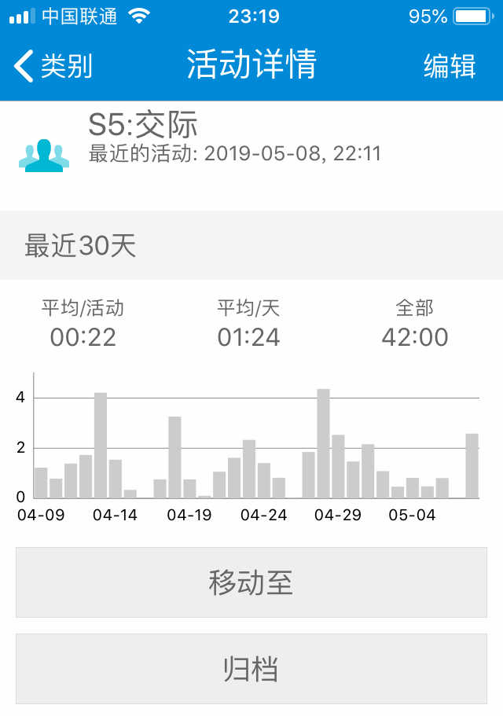
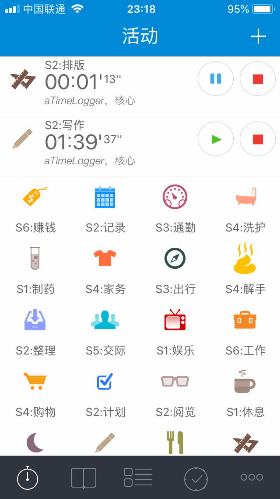
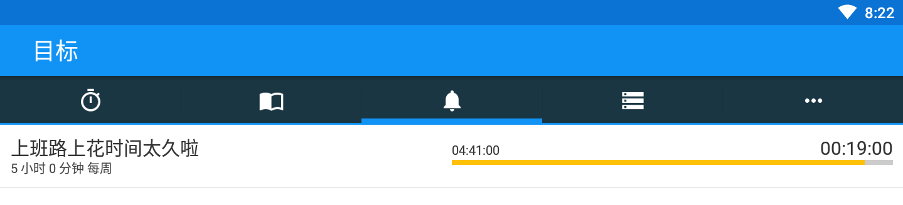
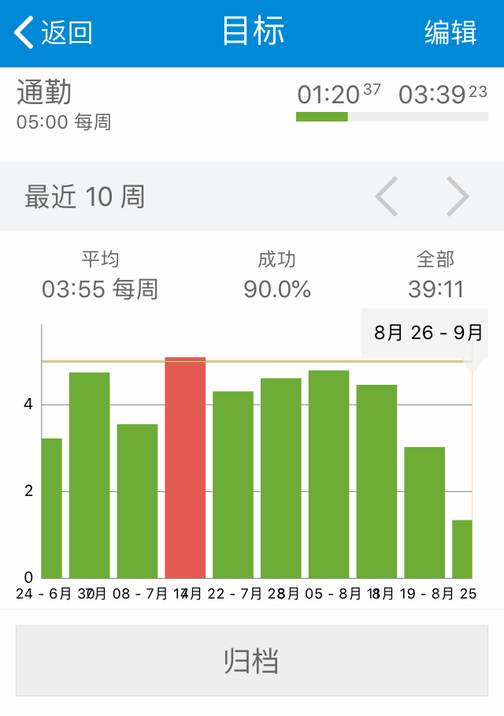
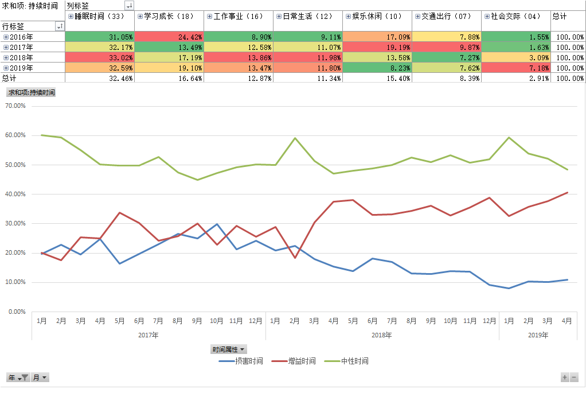
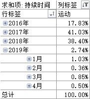
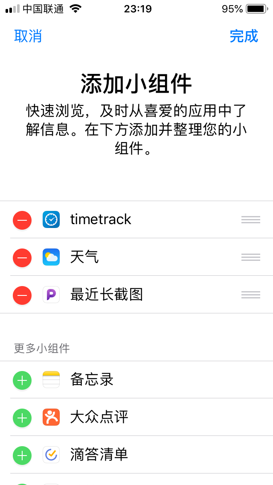

# 13.TimeTrack的5个核心功能

在《一篇文章讲清楚TimeTrack》里就已经介绍过TimeTrack的核心功能，这一节增补些图片和细节。

我认为TimeTrack的有这5个核心功能：

1. 开始/停止记录时间（基础）
2. 目标功能（目标管理/警戒线）
3. 系统自带视图（可视化）
4. 数据导出（Excel分析）
5. 小部件（快捷操作）

在一天中，我们能怎样用上这些功能呢？

打开TimeTrack，在首页点击活动按钮，软件就开始记录这项活动的时间。

比如我开始写文章，那么点击“写作”图标，写完后编辑排版，点击“排版”活动，之前正在进行中的“写作”会自动暂停（要先操作“更多-设置-开始活动暂停之前的活动”），计时器切换到“排版”。

这就是TimeTrack最基础的使用方法，帮我记录我在自己设置的不同类别活动下的用时。

排版完成准备出门上班，点击“通勤”活动，切换计时。

因为今天周五，我一路上走走停停看风景，心情格外好，但是我突然想起来，哦，对了，这周我的“通勤”时间目标好像快超标了。

于是我打开“目标”选项卡（要先操作“更多-设置-显示目标”），看了一眼“通勤”的时间用量。

好险！还差20分钟就超标了，不行，我得在通勤路上做些其他事把“通勤”时间顶替掉。

听书吧，我想起来之前在樊登读书会还有一本《非暴力沟通》没听完。

于是我打开App，同时在TimeTrack里点击“读书”，顺利把时间从“通勤”切换到“读书”。

这是TimeTrack的第二个核心功能“通过目标功能可视化不同活动项的时间用量”。

到了公司，忙活了一上午，吃完午饭，看了一眼所有时间“目标”，很满意，因为暂时没有出现用量超标的情况（没有红色）。

中午不是很困，想着刚好又是月初，得好好分析一下自己上个月的时间用量情况了，毕竟时间过去这么久，看数据比凭感觉更准确。

准备导出数据到Excel，在此之前，我先看了一眼TimeTrack默认的活动消耗柱形图。

在目标页点击进入“通勤”，没想到通勤时间已经连续5周达标了，完成率90%（绿色达标，红色超标）！

接着来到类别页，点击“交际”，进入详情。

最近30天在“交际”上花了42小时，平均每天1个半小时，我都和谁聊了些什么啊，好像完全没印象，应该提高社交质量了！

这是TimeTrack的第三个核心功能，试用不习惯导出数据到Excel分析的同学，“通过内置图表，让自己对大概的时间走势心里有数，也是一种即时反馈。”

最后来到数据导出页面（操作“更多-报告-选择上月-右上角导出报告-CSV”），用Excel打开数据后一顿操作，得到一张月趋势图，发现我的“增益时间”从1月的33%飙到了42%，提高了近10个百分点！

进步很大嘛，感觉人生已经到达了巅峰。

接着却又发现上周的运动时间从4%掉到了0.7%，加班太多，没心思锻炼身体，我说最近怎么精神有点儿恍惚呢，好久没去打球了，啥时候约小伙伴们打场球呢？

不行，我决定，这个月要恢复每日锻炼，身体才是革命的本钱。

这是TimeTrack的第四个核心功能，“通过导出数据到Excel高级分析，从全局角度观察时间的流向，发现问题，刺激自己纠正不良行为”，时间是公平的，一边多了，一边自然就少了。

那么现在，我有了新目标，本月首先要提高“运动”时间！

保存所有数据，关闭Excel，还没上班，躺在椅子上闭目养神。

开始下午的工作了，我拿起手机，准备从“休息”时间切换到“”时间，刚好领导从我身边路过，我心里想，不会让老板觉得我在工作时间老是玩手机吧？我可是天天加班都没锻炼的好员工啊！

我想，有什么办法能“不进入软件，快速切换活动类别呢？”

试试负一屏新增小组件（小部件）吧。点击编辑，添加TimeTrack，完成。

展开TimeTrack列表，这样就能在手机不解锁的状态下右滑屏幕切换时间啦！

> 桌面版正在开发中，目前较好的替代方案是使用MuMu安卓模拟器。

这是TimeTrack的第五个核心功能，“增加小组件，快速切换时间类别。”

这就是TimeTrack核心功能在一天中的使用场景示例。

只要你掌握了这5个核心功能，再用起软件来就会得心应手多了。

到这里，有同学就会说，“涂哥，你忽略了一个很严重的问题！”

你说，“用Excel打开数据后一顿操作。”

一顿操作是什么操作？我们怎么才能做出你这样的图表啊！

别急别急，关于数据制图我会在第四章详细讲解，现在我们先用好软件的系统视图。

比如TimeTrack自带的柱形图、堆积图等等，分别在什么情况下使用？

