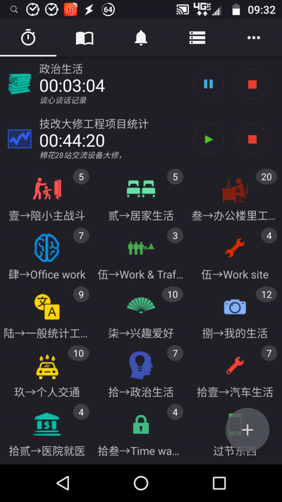

# 15.只保留最多30个活动分类

分类别想着一步到位，因为你没办法凭借记忆明确所有分类，必须得经历好几次犹豫和纠结。

你会遇到很多问题，比如：

1. 多少个分类合适？
2. 用哪种分类方法好？
3. 分类对应的层级关系怎么处理？
4. 分类A和B好像差不多，怎么取舍？
5. 同时做两件事，用哪个分类？

我给学员做咨询的时候，第一步就是让学员自己自己在不同场景会产生哪些动作，找分类：

1. 你工作日的行动
2. 你周末的行动
3. 你大型节假日的行动
4. 你过年的行动

如果你并不太看重分类明细，就想想自己在工作日做哪些是就好。

按照时间顺序来，可能是：

> 起床→洗漱→上厕所→穿衣服→刮胡子（化妆）→通勤→看书→工作→点外卖→吃中饭→聊天→玩手机→学习→休息→工作→收发快递→通勤→吃饭→看电视→买零食→下楼散步→洗衣服→洗澡→睡觉......

这样你一天的大部分行动就找出来了。

如果想要更多更全，就再想想周末、节假日你会干什么，又能增加：

> 逛街、买菜、做饭、参加聚会、驾车、体检、办政府业务、打扫卫生、干家务......

有些行动可能你光凭想象注意不到，只有你真正遇上了才知道，没关系，慢慢来，咱们先抓重点。

给自己先定一条规则：

> 只保留最多30个活动分类。

多出来的分类合并或者放进“其他”这个活动里，注明备注。

为什么首先要限定分类的数量？

因为很多学员听说要从生活中找分类，好像是在比赛谁找的活动更多一样，最后50个100个分类的都有。

比如这样：

算上所有组里的活动，接近100个！可以这样分吗？可以，但是不推荐，特别是新人不推荐。

100多个活动分类，你做事之前选哪个活动要想一次，想好了找到它也麻烦。

所以刚开始请严格执行：

> 只保留最多30个活动分类。

限定分类数量之后，在执行过程中，大家经常会有个疑问：

> “细碎的活动项有必要记录吗？”

比如喝水，上厕所，闭目养神，这种可能持续时间不超过3分钟的时间片段，有必要再单独在软件上点击一下记录吗？

我个人的建议是把细碎的时间合并。

比如，我们可能休息了一会儿之后接着去上厕所，上完厕所回来又休息了一会儿，这个时候正常的操作应该是“休息-厕所-休息”，但是我会把这段时间打包记录为“休息”，当下一次又出现“休息-厕所-休息”的行为时，我会打包记录为“厕所”。这样，我们就把两个活动项的时间互补，这种耗时差别不大的细碎互补记录方式，对我们导出数据的分析结果影响不大。

如果你不想忽略记录细碎时间，可以试试这种打包的方法。

当然，如果你觉得连合并都没必要，那就直接忽略。

但是在选择性忽略之前，建议你仔细观察自己细碎时间的用时情况，比如休息可能每次花5分钟，上厕所只花2分钟，开小差5分钟等等，小误差积累下来在最终的数据里也是个大问题。

你要通过观察它们（约1周）得到一个“基准值”，这样在你分析的时候即便是没有数据，也可以按照基准值进行补足，就算是在快捷和精确度之间做了一次折中。

设定了“只保留最多30个活动分类”这条规则之后，很多同学还是觉得分类不够用，这时候我就会建议，把更细致的分类写进备注栏。

如果觉得每次都要手动填写备注很麻烦的话，有两种快捷方式：

* 1）语音记录

使用输入法的语音输入功能，不仅能记录，还能秒变日记本。

* 2）输入法快捷短语

以搜狗输入法为例，打开属性设置-高级-自定义短语设置-添加新定义。

可以设置输入“ez”时，弹出“tag:儿子”的快捷短语，用来标记角色，这种输入法的替代方案可以大幅提高你的输入效率。

如果你能活用备注区，你会发现分类记录的是我们的时间轨迹，而备注区则是我们的人生轨迹。

梳理完所有活动之后，我们还需要归类，按照某种属性把相同的活动划分到一起。

那么，有哪些划分的维度呢？

