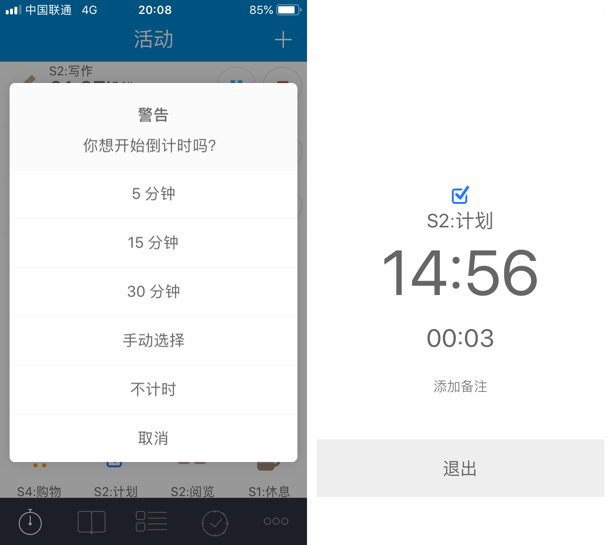

# 25.系统功能——倒计时，防止时间虚耗

倒计时是aTimeLogger Pro才有的功能。

它的界面和番茄钟有点儿像，但是少了强制性，在更多-设置-倒计时，选择开启。

.png>)

设置使用倒计时的活动类别后，开启对应活动时会提示是否使用倒计时。

倒计时最重要的作用是防止自己在某一活动上虚耗时间。

比如我有一个“计划”活动，这个活动的特点是放思考类的行为，但是长时间的思考并不一定有益，甚至可能导致想得太多反而畏缩不前不行动的后果。

所以对这类“很容易花时间，但是时间长并不一定好”的活动，我们可以添加倒计时功能，这样在开启活动后设置倒计时，限制我们必须在某个时间后出结果，避免不必要的时间浪费。

特斯拉的CEO埃隆马斯克（Elon Musk）曾提到过的“TimeBoxing”时间管理法异曲同工。

> 这种被称为“TimeBoxing"的时间规划法，脱胎于迭代式增量软件开发过程中的一种管理方法，即在预算时间内，对完不成的功能进行删减或者延迟，而不是拖延预算的时间。

简单来说，TimeBoxing就是你给自己设定的Deadline。

看来，Deadline还真就是最强的生产力。
