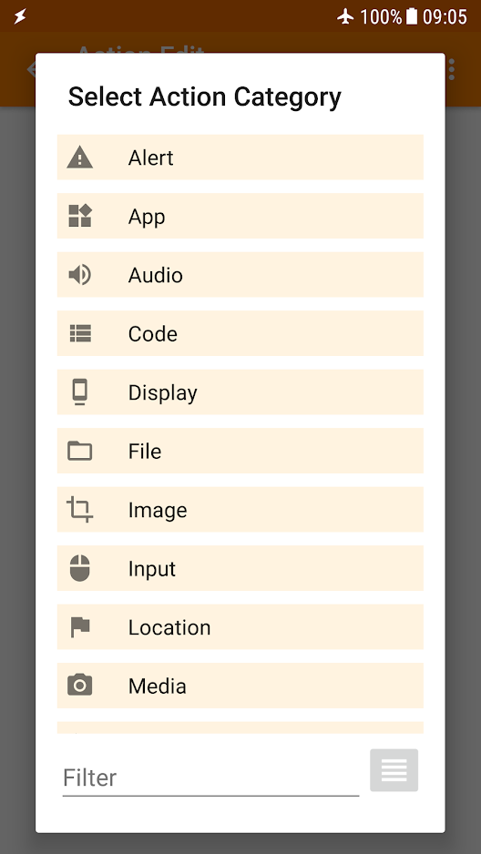

# 54.自动记录——用NFC贴纸实现安卓自动记录

如何实现aTimeLogger/aTimeLogger Pro自动记录，一直是大家重点关注的黑科技。

收集到网上NFC自动记录参考教程，感谢这些创作者的分享：

> [【教程】安卓手机如何实现高效且好玩的(误)时间自动记录？](https://www.bilibili.com/video/av327598337)
>
> [【教程】最高效的时间记录 | 时间追踪系统 | NFC贴自动化设置](https://www.bilibili.com/video/BV1q7411r7Zi)
>
> [【vlog软件】workinghours时间记录](https://www.bilibili.com/video/BV1wE411J7xh)
>
> [安卓系统能否使用如视频中ios的捷径系统做到时间追踪自动化？](https://www.zhihu.com/question/368353659/answer/1067476247)

但是大部分教程都有点复杂，怎么才能最快速简便的上手NFC+aTimeLogger自动记录呢？

实验后我发现，使用我的方法，你可以在3分钟内实现自动记录，化繁为简。

你需要提前准备安卓手机+aTimeLogger+NFC tools+NFC tasks，来快速实现1秒快速记录。

首先下载两款软件：

1）[NFC tools](https://apkpure.com/cn/nfc-tools/com.wakdev.wdnfc)

2）[NFC tasks](https://apkpure.com/cn/nfc-tasks/com.wakdev.nfctasks)

其次，你需要买[NFC贴纸](https://m.tb.cn/h.fuVbMrZ?tk=LFZX2muaHqA)至少两张。

请注意，不管你购买哪家的NFC贴纸，务必选择最大字节容量，888存储字节以上。如果是贴在金属材料上，还要看贴纸是否抗金属，不然容易触发失败。

这时候你手机上应该已经安装好aTimeLogger+NFC tools+NFC tasks，桌边摆有NFC贴纸了。

操作步骤如下：

1）打开手机NFC功能

.png>)

2）打开NFC tools，并靠近NFC贴纸，有任何提示给权限即可

3）在“读”选项卡可以看到NFC贴纸的各种信息及容量

.png>)

4）选择“任务选项卡”，选择“应用程序”，选择“运行快捷方式”，点击放大镜搜索

5）选择aTimeLogger/aTimeLogger Pro，选择你要录入NFC贴纸的活动项，如“工作”，选“Pause running and start”，即为开始新活动时暂停正在进行的活动，保存，点击“OK”

6）点击“写”，然后把NFC贴纸再次靠近手机，直到提示编写成功（提示错误多试几次）

.png>)

7）返回手机主界面测试，把手机靠近NFC贴纸，然后软件开始记录“工作”，搞定

目前有个问题是，同样的活动项不能再次启动，比如aTimeLogger正在运行工作，这时候我贴有工作项的NFC贴纸就会失败，必须是正在记录的和贴纸不同的活动才有效，已经反馈给开发者，待解决。

视频演示如下：

我来粗糙的说说实现NFC贴纸快速记录的原理。

你买的新NFC贴纸就像是干燥的海绵，什么都没有。这时候“aTimeLogger开始记录工作时间”这个动作就像是水，然后你把水倒进海绵里，海绵吸满了水，但是刚好不会溢出来。现在你发现桌子脏了，想用海绵里的水擦桌子，你就用力挤压海绵，把海绵里的水释放出来，马上就有水用，而不需要去水龙头里接水。

所以aTimeLogger里的快捷方式就是水，而我们需要NFC贴纸这块海绵，也需要NFC tools+NFC tasks把水倒进海绵里存着，这样在我们发现桌子脏了的时候，就不需要单独打开aTimeLogger去软件这个水龙头里接水，而是直接用手机贴NFC挤压海绵就能出水啦。

现在你应该知道我为什么在文章中特别提醒“**一定要选最大字节容量NFC贴纸**”，是因为我一开始买了144字节的贴纸，海绵能装的水量不够，溢出了，所以发现录入快捷方式的时候284字节超限，导致录入失败。保险起见，我建议大家购买NFC贴纸时，直接选888字节以上容量。

这种NFC贴纸的常用场景可以是办公室桌面，放置常用的活动如“工作”和“休息”。

这样在切换时就不需要拿起手机打开aTimeLogger，再点击APP活动图标记录，直接手机一贴搞定。

除了我这种简单快速的方式，高级玩家安卓可能会使用tasker+aTimeLogger，苹果玩家会使用iOS+捷径实现自动记录，并且设置条件关系，比如当我的手机时间显示为早上9点前，贴NFC，记录为“学习”，早上9点前，贴NFC，记录为“工作”，有时候甚至不需要NFC贴纸，直接全部在软件里实现。

但是正因为tasker的功能过于强大，新人上手可能会一脸懵逼被劝退。

既然我们的目的是体验NFC快速记录的黑科技，那么马上能用上这个功能才最重要。

所以我选择了“NFC tools+NFC tasks”的组合，同一位开发者开发的软件，兼容性好，汉化完全，上手快。

NFC的玩法远不止于此，爱折腾的同学可以尽情探索。

比如你厌倦了向每个来家里的客人说WiFi的琐碎，可以把你家的WiFi密码写进NFC贴纸，贴在客厅沙发旁边，客人只需要打开NFC将手机靠近NFC贴纸，就自动获取WiFi密码并连接。

比如你希望早上你的闹钟铃声响起后，你房间的智能灯马上打开，饮水机开始烧热水，同时智能音箱开始播放你最爱的播客，边听边洗漱，开始完美的一天。

这些功能未来都可以更方便的实现，但如果你想更早的“用上未来”，不妨多关注关键词“安卓+tasker”，“iOS+捷径”，相信会为你打开新世界的大门。
