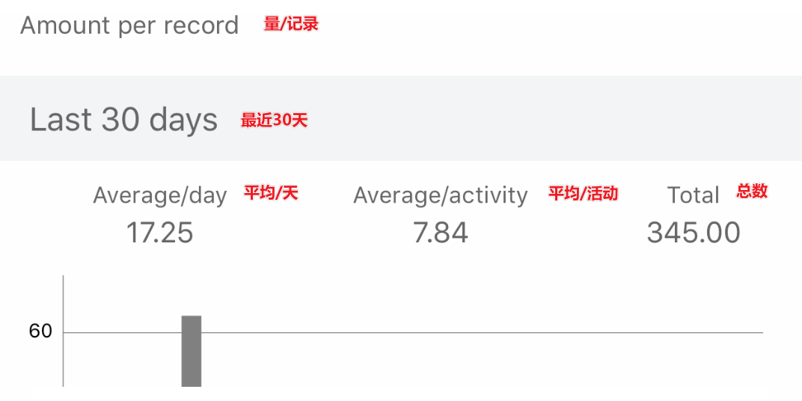
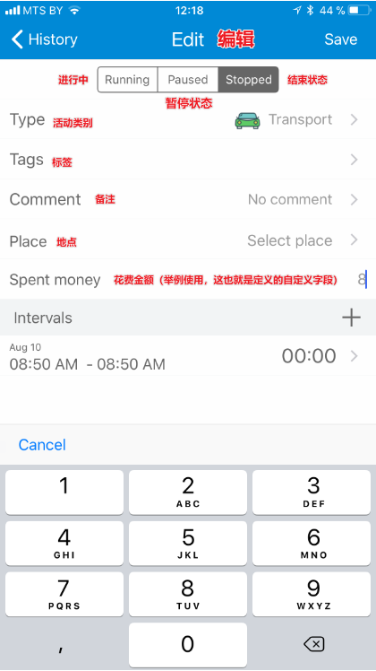
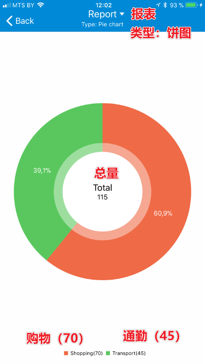
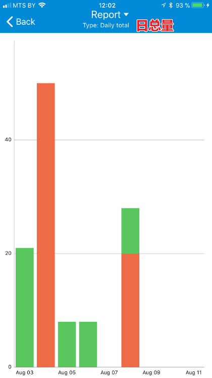
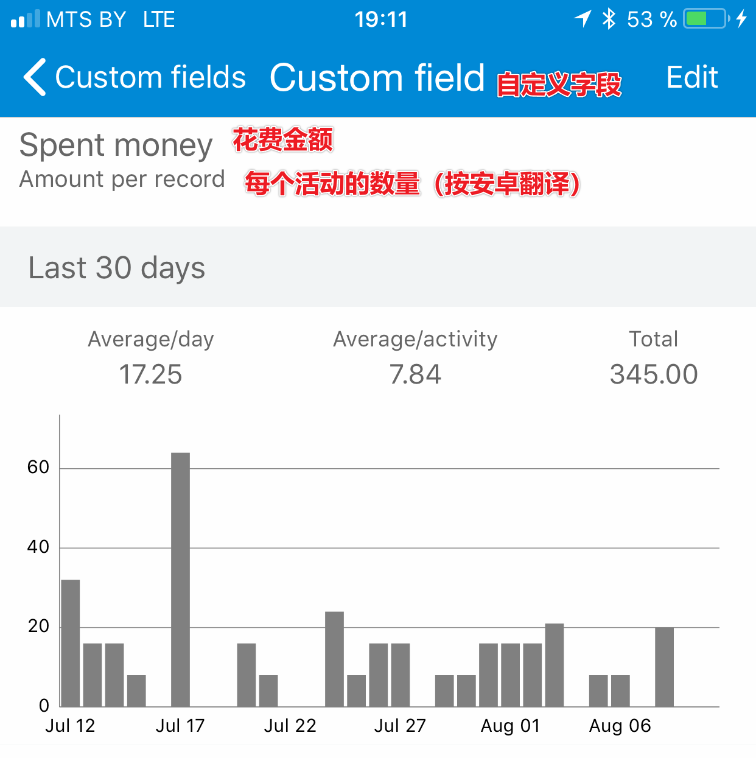

# 56.系统功能——自定义字段，设定时薪

原文 @Sergei Zaplitny：[http://blog.timetrack.io/user-defined-fields/](http://blog.timetrack.io/user-defined-fields/)

译稿 @嘉明Lock：[https://jyzigyb0ly.feishu.cn/docx/EoISdJJYtoNIMnxjSR5c7erRnWg](https://jyzigyb0ly.feishu.cn/docx/EoISdJJYtoNIMnxjSR5c7erRnWg)

在 TimeTrack 1.6（现在也是aTimeLogger Pro），引入一项新功能“自定义字段” （或者就叫“字段”吧）。

<figure><figcaption></figcaption></figure>

已记录活动包含有开始和结束时间、标签/备注（可选）。有时候你的记录可能需要包含其他重要信息，例如在Shopping（购物）这一活动上的“花费金额”，或者 对于自由职业/咨询服务用的“小时单价”，“自定义字段”这一新功能让用户可以记录额外信息，然后使用这些额外信息制作报表。

为了使用这个新功能，用户需要创建实际自定义字段。从【更多】-【自定义字段】到 自定义字段 页，点击“+”添加，进入“编辑”页。

<figure><figcaption></figcaption></figure>

<figure><figcaption></figcaption></figure>

这里提供了两种字段类型：每小时数量 和 每个活动数量。

每小时数量的使用案例——“小时单价”。如果你是一个自由职业者并且你提供服务的小时单价是 $20/小时，那么你可以计算你的所得金额，并把它发给你的顾客。另一个案例是生产力评分——你可以计算你的生产力有多高。

每个活动数量的使用案例——“花费金额”。比如，你去购物花了$30刀，然后你坐出租车回家花了$10刀，你总共花了$40刀。其他案例：你喝的水量、运动成就，如你的引体向上计数。

字段 常常对类别的有限数量非常有用。在选择活动类别后，你可以给每个活动类别输入默认值，比如，你常常在通勤中花费8刀，那就给通勤类别输入8作为默认值。

<figure><figcaption></figcaption></figure>

现在，点击保存（其实是个打钩icon）。

现在编辑活动页中新的一行就会出现。

<figure><figcaption></figcaption></figure>

你可以输入“花费金额”的具体数值，或者使用默认值。

### 报表

为自定义字段制作报表，前往 【更多】-【报告】页，切换到自定义字段（实际是点击“常规”，点击“达标形式”，选择自定义字段），然后选择具体哪项自定义字段、日期范围和活动类别。

<figure><figcaption></figcaption></figure>

点击“创建”（其实是右上角的打钩icon）后，你可以查看总量、饼图和每日数据柱状图

<figure><figcaption></figcaption></figure>

<figure><figcaption></figcaption></figure>

报表也可以导出成CSV文件。

你也可以通过“自定义字段详情”页快速查看自定义字段数据，如果你在自定义字段页选中某个字段，就会显示出来（具体还没开通高级权限，不知道具体安卓啥样，后面再更新）

<figure><figcaption></figcaption></figure>
