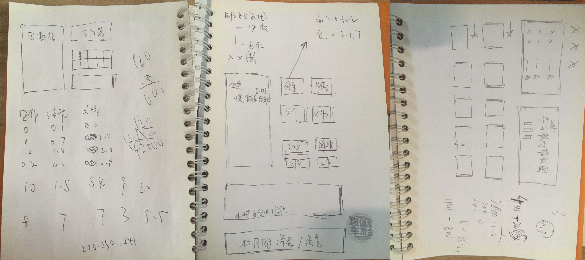

# 30.数据处理自动化，30秒搞定

按月整理的明细数据是我们数据分析的起点，因此这张源数据表我们需要保证：

1. 数据尽量无错，准确性
2. 易用，模板化

我们每月修正一次归类和备注，就是为了尽量提高数据的准确性。

其次我设置了“周”和“月”两张超级表，只需要粘贴数据刷新就能自动更新透视表。接着我把每月需要解析的“S\*”标识设置了VBA（批量替换+分列+删除月初第一条数据），加速数据处理。

这些步骤被全部打包在了一张开启宏的Excel表格中，保证从加入新数据到完成可视化，不超过5分钟，为后续的分析准备数据环境。

最后，我设置了一张每月公开的进度表（2019），刷新数据后复制粘贴成图片发到朋友圈，同步我的时间目标进度。

也就是说，完整的事件记录数据表，包含了“周”数据“月”数据“周透视”数据“月透视”数据，同时备忘了“活动定义表”“布局”，另外有一张数据加工“VBA”表，最后是每月展示的“2019”目标进度表。

并不是说我们有了表格就能做出这样的数据，还必须在TimeTrack中埋下标记。

比如“S\*”标记和备注栏的“\#、@、《”符号等等，在创建活动项的时候就要加在活动里。

有了这张规范的源数据表，我们就能更快速便捷的处理时间数据。

2019年对源数据模板进行了大幅度更新，主要突出重要指标，提高可视化。

例图如下：

有了这张报表，从你在TimeTrack中导出数据，到导入Excel着手分析，2分钟搞定。

有兴趣学习的同学可以加我微信（下图），套用模板包教包会365元，量身定制一对一咨询599元。

这套模板从有想法雏形到真正在Excel上实现它们，花了差不多半年。

从模板的函数处理到VBA，布局到配色，再到红绿灯上下箭头标记，甚至行高列宽，从大到小我能考虑到的细节全部都加在一张Excel里，相当于是把我多年[Excel培训](https://www.aikewang.com/course/14)的经验和时间记录结合，全国独一份。

当然，一对一咨询的意义不仅在于套用模板，而是前人现成的经验和思维：

> 分类怎么处理？可以有哪些分析的角度？能分析什么？

走一次弯路重新梳理分类，又是几个小时，而现在有现成的经验你可以学习，手把手教你从分类到数据处理可视化，省下的时间价值早就不止599元了。

时间就是钱，效率就是命。

30秒搞定TimeTrack数据处理，你也可以！

