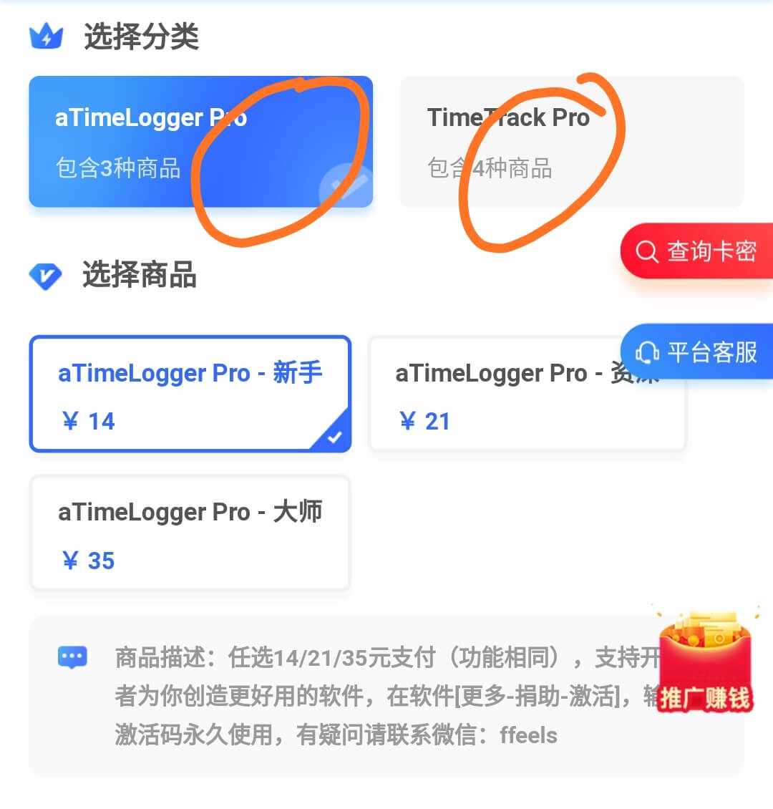

# 第六章：更多内容

《时间去哪儿了：柳比歇夫时间记录法实践手册》

[免费试听2节课](https://study.163.com/course/courseMain.htm?courseId=1209678842\&share=2\&shareId=400000000640077)，快速上手aTimeLogger/TimeTrack：

.png>)

> 自己琢磨3个月，不如高手带1天，本书配套10小时视频，扫码报名还能加入VIP指导群！

作者：涂俊杰（微信号:ffeels）

> 文中使用的[TimeTrack](http://timetrack.io/)、[aTimeLogger](http://www.atimelogger.com/)软件均由@Sergei Zaplitny独立开发。

[aTimeLogger＆TimeTrack付费](https://shijian.tujunjie.com/ch06/ch06.47#wo-yong-an-zhuo-timetrack-dan-shi-wu-fa-sheng-ji-zen-me-jie-jue)请扫码：

.png>)

