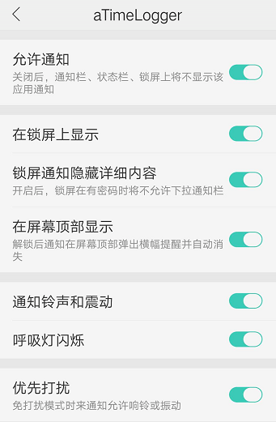

# 47.aTimeLogger和TimeTrack的常见问题

## 导出CSV报告用Excel打开乱码怎么办？

没有装WPS看自行百度CSV乱码解决办法，按步骤处理并不复杂。

## 标签栏为什么没有“目标”？

更多-设置-在标签栏显示目标。

## 为什么不显示“秒”？

更多-设置-显示秒。

## 如何捐助？捐助的不同等级有什么区别？

aTimeLogger捐助链接：http://t.cn/AiCeGfdx

或者直接扫码：

没区别，捐助只表示支持开发者，解锁的功能都一样。

## 已经捐助安卓aTimeLogger，可以直接在iOS上免费使用吗？

不可以，iOS的aTimeLogger 2是付费软件，售价30元。

## 捐助后可以用多久？

一次捐助，永久使用。

## 设置目标时，类型中“最大上限”和“最小上限”有什么区别？

可以理解为有益目标设置最小上限，有害目标设置最大上限，到达目标限度时的提示也

## 为什么捐赠后给@Sergei Zaplitny发了截图他一直没回复？

Zaplitny是白俄罗斯人，和国内有5小时时差，所以他一般在14点后上线。发送邮件后没收到，请查看垃圾箱有没有。

## “登录/同步”下“注销账户”有什么用？

根据欧盟保护隐私规定，用户有权利删除自己的账户数据，所以点击“注销账户”后用户的所有数据，包括账户信息，都会在服务器端被删除，但数据依然在本地（手机上）。

## 国内aTimeLogger的官方商店是哪个？

国内安卓应用商店中Zaplitny只授权上传小米商店，所以其他商店的安装包都是复制品，当然群公告里的安装包也是官方的。

## 为什么在“登录/同步”下点击同步失败？

可能有网络原因，切换WiFi和移动网络重试，如果仍然失败，关掉软件进程，过几分钟后再试。

## 怎样使用“群组”功能？

在“类别”标签下，新建类别时，勾选“群组”，然后移动选择其他类别，点击右上角第二个移动图标，选择需要移动的群组即可。

## 能不能在清单中使用查询功能？

可以，第二个标签栏，右上角有“放大镜”图标，点击即可查找类别名，备注。

## 为什么“日历界面”不见了？

只有当历史清单数据范围为“日”时，才会在左上角显示“日历界面”，因此看下自己选择的时段，是不是被改成了周或月。

## 为什么“交叉时间校正”功能没用？

交叉时间校正只针对“已结束”（第二标签页）的活动起作用，在活动页面修改时间是不会启动这个功能的。

## 为什么手机通知栏不显示正在进行的活动？

更多-设置-通知栏设置，还要检查手机是否设置了通知栏权限，有时候仍然不显示，还可以随便开始个新活动试试。

## 软件有bug找谁反馈？

直接在群内找开发者@Sergei（微信：zaplitny），尽量用英语。

## 怎样成为志愿者帮助推广/改进翻译等？

欢迎，小问题可以直接群聊，大问题或者长期改进可以直接联系群主@涂俊杰或是@Sergei

## 数据的安全有保证吗？

有，软件已经稳定运营5年，基础的数据安全还是有保证的，但如果出现数据莫名丢失请马上@Sergei，他会帮你解决。

## 安卓的aTimeLogger和iOS的aTimeLogger 2有什么区别？

功能上基本相同，分别命名为1和2原因是在iOS上线了aTimeLogger 1随后迭代到aTimeLogger 2，接着在aTimeLogger 2的基础上开发了安卓版本，因此安卓aTimeLogger 1=iOS aTimeLogger 2

## aTimeLogger和TimeTrack有什么区别？

两款软件均为Sergei开发，最主要的区别是TimeTrack拥有番茄钟和标签功能，订阅制付费，暂未加入支付宝付款，需要VPN走谷歌商店，且本地化不完善，安卓版尝鲜地址点此下载。

TimeTrack高级版有如下功能：

价格如图示（iOS）：

## 怎样自定义类别图标？

编辑类别图标时，进入左下角创建新图标，从相册中选择格式为png的图片，注意要png格式。

## 覆盖安装软件时，数据会丢失吗？

升级覆盖安装不会丢失，但是回退版本或是删除重装时要注意必须先“同步”数据，保证数据记录是最新，然后再安装。

## aTimeLogger没有“番茄钟”怎么办？（活动每次/每时间段区别）

aTimeLogger本身没有“番茄钟功能，但是我们可以设置“目标”，用目标的特性自制番茄钟。添加目标，设置最小投入时间，“每时间段”表示启用对应活动后每间隔该时间段就提醒一次，暂停重开就算一个时间段；“活动每次”表示启用对应活动后不论中途是否暂停，都只统计一次，只要达标即提醒。

@永恒的笨蛋：关键区别就是，如果中间暂停的话，活动每次重新计时，每时间段累接上次计时。

## aTimeLogger有客户端或是网页版吗？

客户端暂无，有网页版，但bug较多，不建议使用，目前改进中。

## 捐助页面打不开怎么办？

如果捐助页面打不开，有条件的可以挂VPN，没条件的更换浏览器，切换4G/WiFi重试，还不行就再等等。

## 想和@Sergei Zaplitny交流，但是我不会英语怎么办？

电脑端用[谷歌翻译](http://translate.google.cn/)，手机端用讯飞输入法的快捷翻译功能。

## 怎么修改类别名称和调整排列顺序？

进入倒数第二个“类别”标签，点击进入对应类别，右上角点击“笔”字样图标，编辑即可重命名。长按图标即可调整顺序。

## 导出报告时怎样更换默认导出软件？

手机打开设置-应用程序-进入aTimeLogger-默认打开-清除默认操作，即可重新选择。

## 更换手机后点击恢复激活无效？

请联系@Sergei Zaplitny

## 填写激活码时，大小写不同有影响吗？

无

## 为什么aTimeLogger不能完整记录24小时，最多只有23:59？

按照时区来说有24:00，但是按照时间的说法最多只有23:59，24:00就是第二天的00:00了。

## 已捐助但是后悔了不想要了能退款吗？

能，发送支付截图+邮箱，联系@Sergei或是@涂俊杰。

## aTimeLogger捐助后有哪些功能？

## 捐助后的高级统计功能有什么用？

“高级统计”可以显示群组和每个类别的消耗占比，能让数据更清晰了，方便观察。

## 可以直接把类别修改为群组吗？

不可以，目前必须新建群组，然后把类别移动到该群组下。

## 为什么设置的目标提醒没有提示音？

检查手机设置里APP的权限是否全开。

## 想订阅TimeTrack但是不能用支付宝怎么办？

目前常规渠道订阅只能是上淘宝买礼品卡，挂VPN走Google Play付款。针对群aTimeLogger用户想使用TimeTrack高级版的，可以联系@Sergei Zaplitny，他会给你开1个月高级版权限免费使用，正在加紧增加支付宝支持。

## aTimeLogger有没有手表版本？

iOS和安卓都有，但是不保证全部能用，请自行去商店下载亲测。

## aTimeLogger可以和日历软件对接吗？

aTimeLogger不行，TimeTrack可以。

## aTimeLogger的活动备注有没有字符限制？

有，上限1万个字符。

## aTimeLogger的活动类别有没有上限？

无。

## aTimeLogger和TimeTrack怎样修改密码？

软件内目前没有修改密码的选项，进去这网址就可以修改了：[https://app.atimelogger.com/\#/restore](https://app.atimelogger.com/#/restore)

## 在一台安卓设置上订阅TimeTrack后，在其他设备登录相同的TimeTrack账号可以继续享受订阅吗？

可以。

## 换手机以后还要再激活吗？

换手机或者激活莫名消失后点击更多-捐助-激活-恢复，重新发送验证码，如果错误，群里@Sergei，会重新给你发送。

## 我用安卓TimeTrack，但是无法升级，怎么解决？

目前有两种方法：

① 在iPad或是iPhone上下载付费，再用账户登录安卓。

② 使用aTimeLogger的捐助链接，捐助同等金额，支付截图发我或者开发者，帮忙开通。

捐助可直接扫码：

1）3个月=￥14

2）6个月=￥21

3）12个月=￥35

