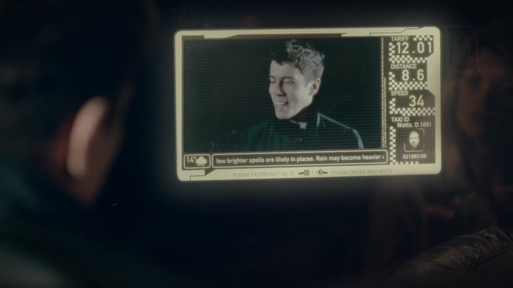
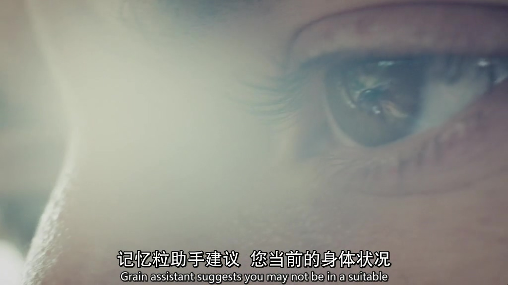
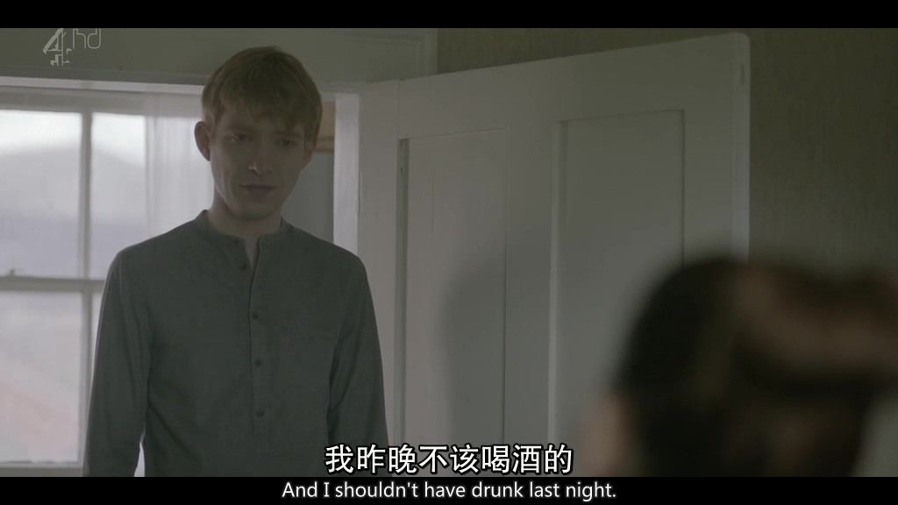
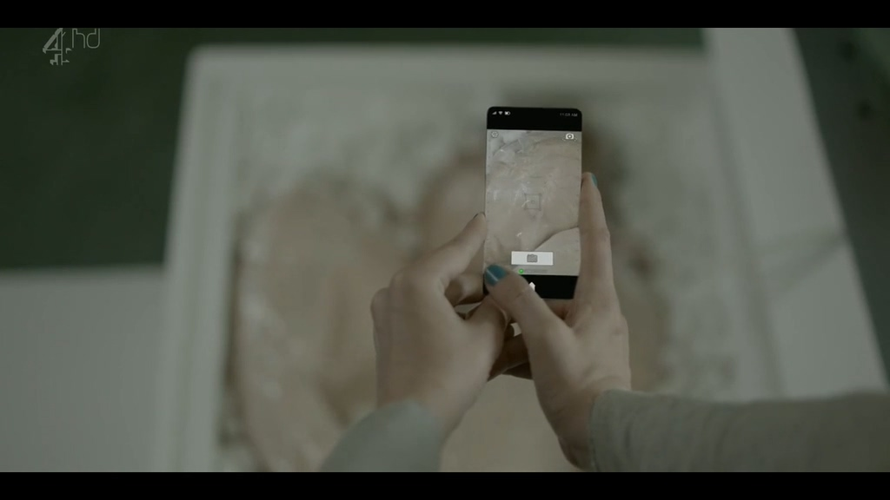
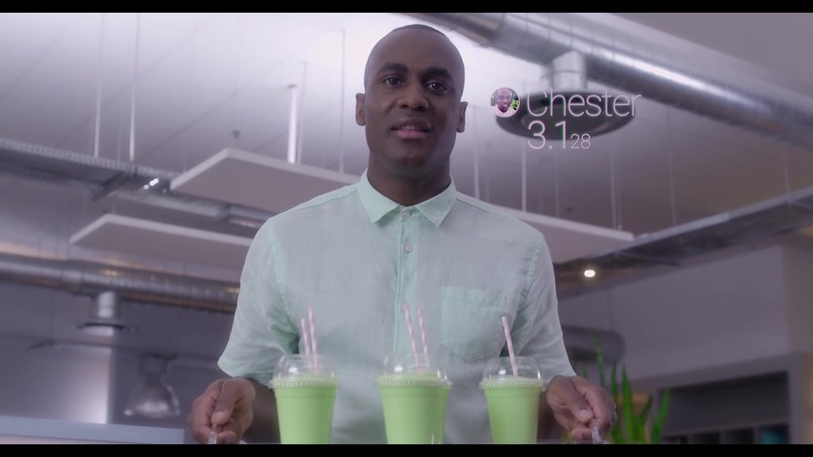
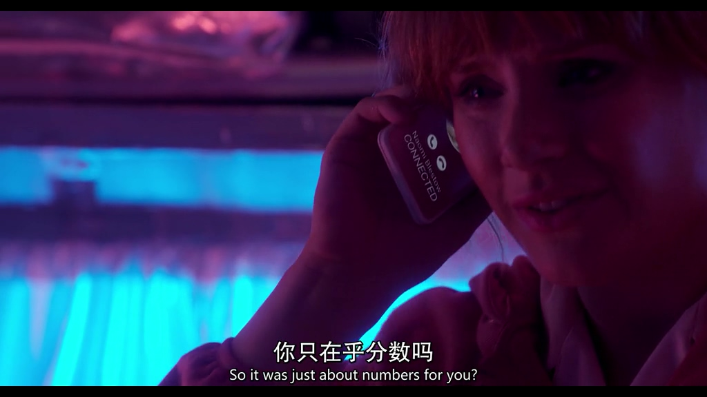
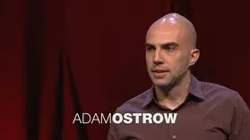
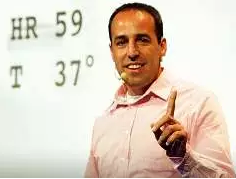

# 51.万物互联，未来的时间记录畅想

**未来的记录一定是完全自动化且无感的。**

换言之，你感觉不到自己被记录了，但记录已经渗透你的生活，沉淀的**数据会比你更了解你**。事实上现在局联网巨头已经在做这件事，想想各家APP的智能推荐。

前几年看过《黑镜》之后，有几个场景我始终不能释怀，我觉得，那可能真的就是未来。

比如《黑镜》第一季第三集里，每个人脑后都内置一块芯片，芯片会帮你记住你**眼睛**看到的所有画面，随时调用分享，还能自动分析你血液里的酒精含量，你的心率变化等等生理指标，在你酒后开车时，芯片会在脑内**提醒**你这么做的风险。

比如《黑镜》第二季第一集里，通过搜集一个人在世时的所有的资料，照片、语音、他写的文字、他做事的风格、他面对不同的事件产生的情绪，自动整合并模拟成“他”，实现**生活复刻**或者是**数字复活**。

还有《黑镜》第三季第一集里，人和人之间的交往，实现了**打分机制**。

也像《原则》作者Ray Dalio提到的“棒球卡”，当我们的工牌信息互换的时候，就知道这个人他被认可什么擅长什么，有哪些标签，喜欢做什么不喜欢做什么，最终实现系统自动判断出哪个一组人安排在一起做哪件事情可能会更好。

信息互换的工牌日本人矢野和男（著有《人生新算法》）已经实现，他称呼这种工牌为“**商业显微镜（Business Microscope）**”，通过工牌记录佩戴者每天和不同人见面/交谈的次数，休息时他跟哪些人在一起更多，GPS数据等等。

虽然《黑镜》这几个故事最后的结局都不好，恐怖谷现象、伦理道德、安全问题都引发人对未来的恐惧，但我相信**万物互联**的数字生活一定会成为现实！

除了科幻作品，还有几场[TED](http://mp.weixin.qq.com/s?__biz=MzI3MzU5MDA1OQ==&mid=2247484029&idx=1&sn=46564fe260f85e48fe9884b37377eca0&chksm=eb21b039dc56392f39c692cc567b161da3379249857c9b69fc1a1303c1f58dad4dfec318f55f&scene=21#wechat_redirect)，也值得参考：

**①** [**每个人的故事都值得聆听**](http://t.cn/RyNIOKF)\*\*\*\*

我喜欢StoryCorps的理念，未来我们如何证明我们存在过这个世界？与其在临死前后悔，为什么不现在就行动？

**②** [**最后的状态更新之后**](http://t.cn/RAcT4O3)\*\*\*\*

人死后我们的社交账户怎么办？等着官方回收吗？是时候考虑你的“数字遗产”了。

**③** [**数据化的自我**](https://dwz.cn/PPhMLNqm)\*\*\*\*

这场TED距今9年，那时候演讲者就已经能通过穿戴设备追踪分析自己的身体，情绪，饮食，花销等等，后来还成立了QS（Quantified-Self）组织，里面有各种量化大神。

当然，不管记录方式怎样发展，都离不开“**觉知-预警-取舍-优化**”，这样的正向循环，未来科技会让我们“**更方便的记录**”，你可以等到科技更发达再开始，但是时间不会等你，所以你不妨[现在就开始](http://mp.weixin.qq.com/s?__biz=MzI3MzU5MDA1OQ==&mid=2247484873&idx=1&sn=b45dd7055fced2c82fbd73482814f94f&chksm=eb21b78ddc563e9b9566f248e8ddc8b665ff5eee22aac28a41a9d6b32f4e78a8a9a2d982ac78&scene=21#wechat_redirect)。

\#

最后，推荐相关的电影清单：

《黑镜》

《黑客帝国》

《超体》

《超验骇客》

《千钧一发》

如果你发现有类似的电影推荐或任何资料，欢迎推荐给我呀！

