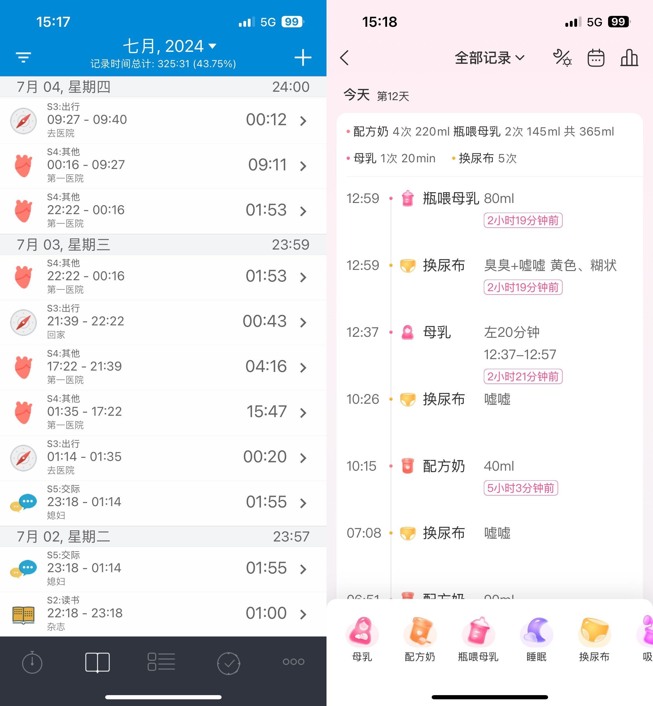

# 💬 读后感

#### 2022-06-07 16:13:36

在第一章节，我用了大量篇幅讲我为什么开始时间记录，再读时觉得实在啰嗦。

我能理解为什么这么啰嗦，甚至用了这么多“推销”话术，因为大部分新手需要过来人的坚决和肯定。

但其实，不管是时间记录还是任何时间管理的方法，都只是方法论，方法和工具都是次要。

最重要的是你能找到内心的秩序感。

在第二、三章节，用图例注明了我是怎样使用软件的，但受限于软件更新和我的使用方式，搭配手表APP以及[日程](http://blog.timetrack.io/ri-li-gong-neng/)、[自定义字段](ch03/ch03.56.md)、[URL快捷方式](https://support.apple.com/zh-cn/guide/shortcuts/apd624386f42/ios)等功能，都没有详细介绍，是个缺憾。

在第四章节，那么多的配图和Excel细节描述，用文字写出来，不知道有多少人愿意看。但能写出来，对我自己来说，是功德一件，现在让我写，我真下不了笔了。佩服那时的自己。

第五章，只是单纯的提供用数据看问题的角度，忽略了情绪和心理价值，请勿对号入座。

距离这本电子书成文已时隔3年，恍惚恍惚，只能说“我庆幸自己仍在记录。”

#### 2023-05-04 16:34:49

好快，又是一年。今年 ChatGPT 应该是绝对主角了。

aTimeLogger 的用法上，没什么变化，不过后端我用 ChatGPT 重写了 Excel VBA 的代码，运行速度快了那么一丢丢。现在已经有 Excel 自动分析的 AI 了，书里第四、五两章的内容，不久后说不定就要淘汰，将来大家只需要把 Excel 丢进 ChatGPT，AI 会自动生成时间报告，并且提示你有什么问题可以问它。

如果想要开始时间记录，工具不再是问题，并不一定非得 aTimeLogger，大家对「精确性」的要求不见得那么强，用手机和电脑工作的朋友，完全可以用「屏幕使用时间+StayFree」自动记录，抓大放小。

再加上飞书仪表盘和 Notion 之类的工具崛起，用传统 Excel 做数据后端的方式，也变得笨重，但我的操作方式几年没变过，一来我已经建立系统，新工具再好，也不如老伙计顺手。二来懒了，不能「大幅度」提高效率的话，不如不干。反观新朋友，不必听我瞎掰，放手折腾吧。

#### **2024-07-14 15:14:05**

今年发生了件大事——生娃了。

生娃的前两周，基本是无效记录，一天里只记了「医院」和「睡觉」，忙得没时间切换。老婆孩子要休息，连喊 Siri 捷径都没空。记录的重点，也暂时从时间切换到了美柚，只记了小宝几点吃喝拉撒，几时换的尿不湿。

<figure><figcaption></figcaption></figure>

我开始理解有人说「哎呀太忙了根本没时间记，拖久了不想补慢慢就断了」的做法，太常见了。 遇到这种情况，可以等到不忙了再回头找「时间戳」。比如什么时候给小宝拍过照路过视频，或者像我从美柚里找时间记录。甚至忙完这段不补录也行，高强度的生活状态不会持续太久，度过这个阶段就好。
