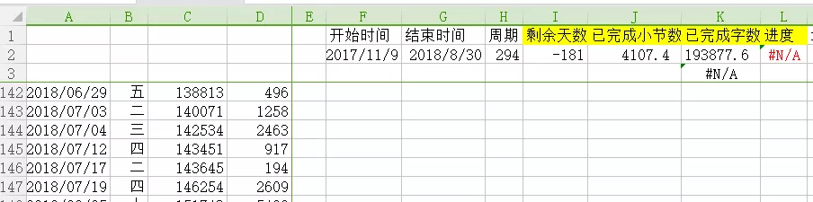
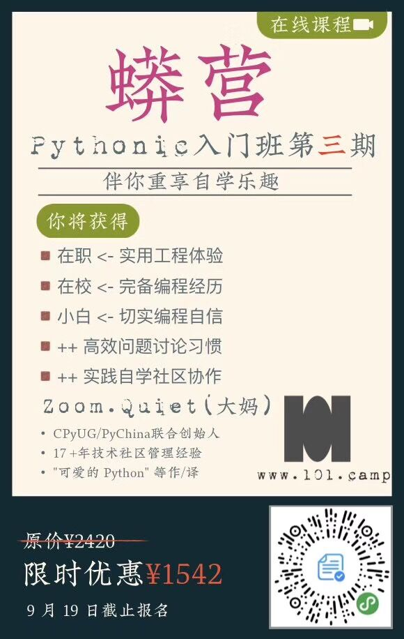

# 特别推荐

学习之路需要良师益友为伴，把我的朋友们推荐给大家！

### Anki - Leo

Leo是国内使用Anki的大神，如果你想学习Anki，提高学习效率，找他准没错！

公众号：学习骇客

详细的课程介绍请看：http://t.cn/E9jAU3n

[购买地址](https://item.taobao.com/item.htm?spm=a1z10.1-c.w4004-21524861135.5.49bd3d9ckGqvDC&id=595307408604)：淘宝店搜索店铺“学习骇客”

> 福利：购买时说“涂俊杰”推荐，有9折优惠！

### Python - Zoom.Quiet

Zoom.Quiet是真·Python大牛！

用Python17年，培训经验13年，这可不是新兴的讲师，而是元老级的实践者。

推荐他亲自带的Python入门训练营，9月下旬开营，6周时间帮你上手Python

今天大妈的Python入门训练营开始招生了，他亲自带，9月下旬开营，6周时间帮你上手Python项目！

Python训练营官网：https://py.101.camp/\#101camp

> 福利：扫码报名时在“引荐”处填写“涂俊杰”，可减免学费99元！

### 极速写作 - 剑飞

我在本书开篇就说剑飞是我的[启蒙导师](https://shijian.tujunjie.com/ch01/ch01.01)，他现在专注付费指导语音写作，指导学员创作字数破4亿！

报名链接：http://t.cn/AiR74CNq

